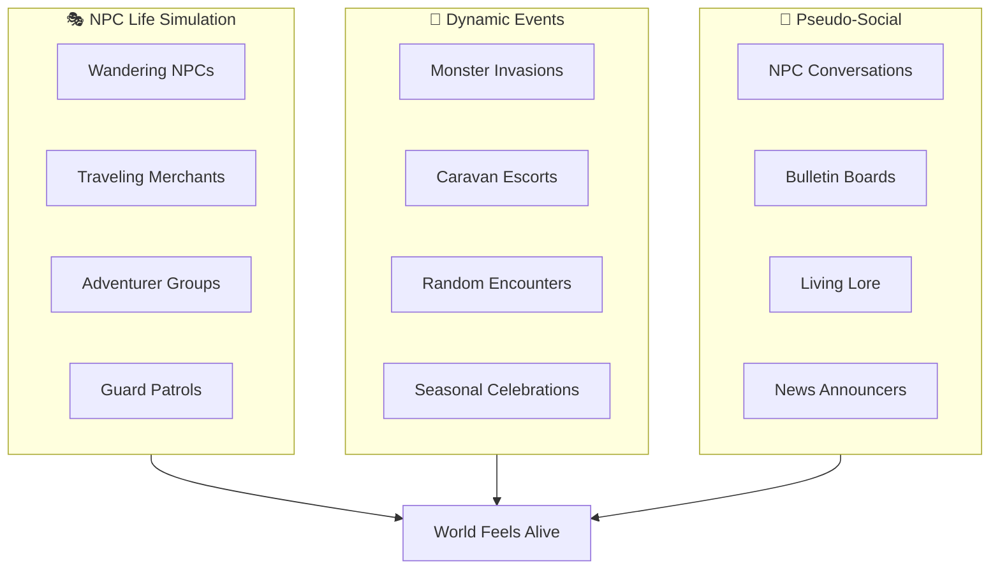
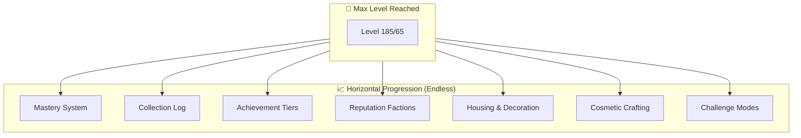

# Photonic Singularity: Solo-Centric RO Game Loop Design

> [!IMPORTANT]
> This grand plan and all associated sub-systems are designed specifically for the **Renewal** version of rAthena.

🔗 **Detailed Task Breakdown:** [Phase 1 & Phase 4 Breakdown](plans/phase_1_and_4_breakdown.md)

> A solo-centric experience with couch co-op vibes — designed for 1-3 players, script-only implementation, and a living world that never feels empty.

---

## 🚀 Master Feature Tracking

### Phase 0: Shadow Tracking Persistence
| Feature | Status | Details |
|---------|--------|---------|
| **Kill Tracking** | ✅ [DONE] | [Kill Tracking Architecture](shadow_tracking/kill_tracking.md) |
| **Loot Tracking** | ✅ [DONE] | [Loot Tracking Architecture](shadow_tracking/loot_tracking.md) |
| **Economy Tracking** | ✅ [DONE] | [Economy Tracking Architecture](shadow_tracking/economy_tracking.md) |
| **System Architecture** | ✅ [DONE] | [Core Persistence DB Schema](shadow_tracking_plan.md) |

### Phase 1: Core Mechanics & Solo QoL
| Feature | Status | Details |
|---------|--------|---------|
| **Tiered EXP Rates** | ✅ [DONE] | 1x (1-30), 2x (31-60), 3x (61-99), 4x (100-150), 5x (151+) |
| **Starter Kit** | ✅ [DONE] | Potions, Wings, Meat, 5k Zeny on first login |
| **Kill Recovery** | ✅ [DONE] | Flat HP/SP heal on kill based on mob level |
| **Support Class Viability** | ⏳ [PENDING] | Solo damage buffs & free mercs for Priests/Bards |
| **Refine Safety Nets** | ⏳ [PENDING] | Blacksmith Blessing & Insurance scripts |
| **Boss/Mob Tuning** | ⏳ [PENDING] | Config changes for density and respawn times |
| **Dual-Client Policy** | ⏳ [PENDING] | Config change to allow 2 clients per IP |

### Phase 2: Living World & Discovery
| Feature | Status | Details |
|---------|--------|---------|
| **Town Criers** | ✅ [DONE] | Dynamic news: MvP kills, merchants, rumors |
| **Adventurer Parties** | ✅ [DONE] | Wandering player-like NPCs in fields |
| **Town Guards** | ✅ [DONE] | Patrol paths in Prontera |
| **MvP Tracking** | ✅ [DONE] | Global tracking of last MvP killer/name |
| **Easter Eggs (Basic)** | ✅ [DONE] | Lost Child (random spawn), Old Sage (Payon) |
| **Easter Eggs (Advanced)** | ⏳ [PENDING] | Riddler (daily rotation), Ghost Knight (Glast Heim) |
| **Wandering Merchants** | ✅ [DONE] | Traveling Merchant Marcus logic |

### Phase 3: Systems & Economy
| Feature | Status | Details |
|---------|--------|---------|
| **Daily Junk Sink** | ✅ [DONE] | Merchant selling overpriced account-bound utility |
| **System Tablet (Basic)** | ✅ [DONE] | Progression Guide, Market Pulse, Monster Intel |
| **System Tablet (Deep)** | ✅ [DONE] | Added monster drops/rates to Intel App |
| **Investment Bank** | ✅ [DONE] | 1% daily interest, 2% deposit fee, 10% cap |
| **Bill Notes** | ⏳ [POSTPONED] | Replaced by existing Diamond trade (500m store of value) |
| **Item Gacha** | ⏳ [PENDING] | Token-based gambling for cosmetics/consumables |
| **Stock Momentum** | ⏳ [PENDING] | Advanced trend logic for the Stock Exchange |

### Phase 4: Mastery & Endgame
| Feature | Status | Details |
|---------|--------|---------|
| **Instance Scaling** | ⏳ [PENDING] | Solo/Duo/Trio difficulty variants for bosses |
| **Mastery System** | ⏳ [PENDING] | Post-max level growth (infinite prestige stats) |
| **Collection Log** | ✅ [DONE] | Zone-based item collection tracking |
| **Global Collector Enhancement** | ⏳ [PENDING] | Randomize collection requirements & rewards (Web-assignable) |
| **Junk Sink Enhancement** | ⏳ [PENDING] | Randomize stock & read from dynamic pool (Web-assignable) |
| **Junk Trader Enhancement** | ⏳ [PENDING] | Expand junk pools & read from dynamic pool (Web-assignable) |
| **Stock Exchange SQL Migration** | ✅ [DONE] | Move price/dividend data to SQL for history & web-admin access |
| **Achievement Tiers** | ⏳ [PENDING] | Repeating kill/refine thresholds with rewards |
| **Reputation Factions** | ⏳ [PENDING] | Daily quests and rep-locked rewards |
| **Challenge Modes** | ⏳ [PENDING] | Roguelike dungeon runs with modifiers |

### Phase 5: Infrastructure (Admin & Player Portal)
| Feature | Status | Details |
|---------|--------|---------|
| **Player Web Portal (MVP 1)** | ✅ [DONE] | [Web Portal Architecture & Plan](plans/web_portal_plan.md) (Bun/Elysia/Vite/Replica DB 3307) |
| **Web Admin Panel** | ⏳ [PENDING] | Economic & Player data dashboard (React/Node) |
| **Encyclopedia NPC** | ⏳ [PENDING] | Central info guide for all custom systems |

### Phase 6: Service Extraction (Decoupling)
| Feature | Status | Details |
|---------|--------|---------|
| **Market Simulation Extraction** | ✅ [DONE] | Moved `OnClock` hourly/midnight stock market logic from game server to Elysia web backend cron. |
| **Atomic Web Transactions** | ✅ [DONE] | Built `/api/market/buy` & `sell` routes using `online=0` atomic SQL to prevent Zeny desync. |

### Phase 7: Phased Municipal Stock Market Expansion (Regional Rollout)
| Feature | Status | Details |
|---------|--------|---------|
| **Phase 7.1: Schwarzwald Tech & Industrial Expansion** | ⏳ [PENDING] | `LHZ` (Pure Growth Biotech), `EIN` (Industrial CapEx), `YUN` (Deep-Tech Venture), `HUG` (Leisure Micro-Cap) |
| **Phase 7.2: Rune-Midgarts Domestic Expansion** | ⏳ [PENDING] | `ADB` (Kafra Blue-Chip Utility), `CMD` (High-Beta Casino), `IZL` (Transport/Defense), `LUT` (Toy Factory) |
| **Phase 7.3: Theocratic Sovereign & Commodities** | ⏳ [PENDING] | `RAC` (Freya Sovereign Gold Trust), `VEI` (Volcanic Energy), `JAW` (Luxury Monopoly), `UMB` (Raw Ecotourism) |
| **Phase 7.4: Global Cultural & Agrarian Markets** | ⏳ [PENDING] | `LOU` (Herbal Healthcare), `MOS` (Forestry Value), `AMA`, `AYO`, `GON`, `BRA`, `DEW`, `MAL` |
| **Phase 7.5: Outliers & Interdimensional Markets** | ⏳ [PENDING] | `NIF` (Distressed Junk Bond), `DIC`/`SPL`/`MAN` (Ash Vacuum Frontier) |

---

## Core Philosophy (Revised)

### The Four Pillars

| Pillar | Goal | Implementation |
|--------|------|----------------|
| **Solo-Centric, Party-Welcome** | Designed for 1 player, scales naturally to 2-3 friends | NPC script scaling |
| **Earn Everything** | All gear obtainable via gameplay, premium items via quests | Character-bound rewards |
| **Living World** | World feels alive even when empty | NPC scripts, events, ambient life |
| **Script-Only** | No source code modifications | Admin-scriptable via NPC/event scripts |

### Target Experience

```
┌─────────────────────────────────────────────────────────────────┐
│           PARTY SIZE OPTIMIZATION                                │
├─────────────────────────────────────────────────────────────────┤
│                                                                  │
│   ★★★★★  Solo (1 player)    ◄── Primary design target           │
│   ★★★★★  Duo (2 players)    ◄── Couch co-op vibes               │
│   ★★★★☆  Trio (3 players)   ◄── Small friend group              │
│   ★★★☆☆  Party (4-6)        ◄── Works, but not optimized        │
│   ★★☆☆☆  Raid (12+)         ◄── Available but not required      │
│                                                                  │
└─────────────────────────────────────────────────────────────────┘
```

---

## ⭐ Living World System (Solving Empty World Feeling)

> [!IMPORTANT]  
> This is the CRITICAL innovation for solo play. An empty server must still feel alive.

### The Problem

Solo/low-pop servers often feel:
- Ghost towns with no player activity
- Abandoned world, no sense of life
- Lonely grind without social interaction
- Static maps that feel dead

### The Solution: Ambient Life Layer (Script-Only)



### Living World Components

#### 1. Wandering NPC System
| NPC Type | Behavior | Script Implementation |
|----------|----------|----------------------|
| **Traveling Merchants** | Appear at random towns with rotating stock | `OnTimer` + random spawn script |
| **Adventurer Parties** | "Players" who hunt monsters, chat, and rest | Mob with custom AI sprites + dialogue |
| **Town Guards** | Patrol paths, react to players, give rumors | Waypoint scripts with interaction |
| **Villagers** | Day/night schedules, go to work/home/tavern | Time-based spawn/despawn |
| **Bards & Storytellers** | Share lore, sing songs at taverns | Random dialogue rotation |

**Example Script Behavior:**
```
Traveling Merchant "Marcus"
├── Spawns in Prontera (Mon/Wed/Fri)
├── Says "Fresh goods from Payon!"
├── Sells unique regional items
├── Despawns after 3 hours
└── Next appears in Geffen (Tue/Thu/Sat)
```

#### 2. Dynamic Event System
| Event Type | Frequency | Script Trigger |
|------------|-----------|----------------|
| **Monster Invasion** | Random 2-4x daily | Timer + random map selection |
| **Lost Traveler** | Every 2 hours | Random field spawn, escort quest |
| **Treasure Hunt** | Daily | Clue NPCs + hidden item spawns |
| **Weather Events** | Ambient | Visual effects + buff/debuff zones |
| **Festival Days** | Weekly | Scheduled town decorations + NPCs |

#### 3. World News & Bulletin Boards

Every town has a **Town Crier NPC** that announces:
- Recent MvP kills (even by NPCs!)
- Current events happening
- Merchant arrivals
- Weather/season changes
- "Rumors" that hint at secret quests

```
Town Crier: "Hear ye! The adventurer Marcus slew 
a Baphomet yesterday! The roads are safer... for now."

Town Crier: "A traveling merchant from the East 
has arrived at South Prontera gate!"
```

#### 4. Fake Player Activity (Ethical Transparency)

> [!NOTE]  
> These are clearly marked as NPCs, not fake "online players."

| Feature | Purpose |
|---------|---------|
| **NPC Adventurers** | Named NPCs with job sprites that "hunt" in fields |
| **Combat Sounds** | Distant sound effects in dungeons |
| **Camp Sites** | Temporary NPC camps that appear/disappear |
| **Crafting NPCs** | NPCs visibly crafting at workbenches |

---

## Quest-Obtainable Premium Items

> [!CAUTION]  
> All "cash shop" tier items are obtainable in-game. Character-bound. Economy-safe.

### The Dual-Path Philosophy

```
Premium Item
     │
     ├──► Long Quest Chain (Weeks of effort)
     │         └── Guaranteed reward
     │
     └──► Easter Egg NPCs (Luck/Knowledge)
               └── Answer correctly on first meeting = instant reward!
```

### Easter Egg NPC Examples

| NPC | Location | Trigger | Reward |
|-----|----------|---------|--------|
| **Old Sage** | Hidden cave in Payon | "What is the true meaning of power?" → "To protect others" | Costume Aura |
| **Lost Child** | Random spawn | Give them a Candy (not asked for) | Premium Pet Egg |
| **Riddler** | Changes location daily | Solve riddle on first attempt | Battle Manual x50 |
| **Ghost Knight** | Glast Heim at midnight | Bow to him before he speaks | Shadow Gear box |

### Long Quest Examples

| Quest | Duration | Requirements | Reward |
|-------|----------|--------------|--------|
| **Path of the Collector** | ~3 weeks | Collect 1 of every monster drop in a region | Premium Headgear |
| **The Artisan's Journey** | ~2 weeks | Craft 100 different items | Bubble Gum x100 |
| **Monster Researcher** | ~1 month | Defeat every monster species once | Enriched Ores box |
| **Lore Master** | ~2 weeks | Find and read 50 hidden books | Costume Wings |

### Safety Mechanisms

| Mechanism | Purpose |
|-----------|---------|
| **Character-Bound** | Cannot be traded or sold |
| **Reasonable Power** | Nice to have, not required |
| **Consumables Limited** | Battle Manuals give 50% bonus, stack limit 10/week |
| **No Exclusive Power** | Similar items obtainable through normal play |

---

## Script-Only Implementation Guide

> [!IMPORTANT]  
> All systems designed to work with NPC scripting and configuration only. No source modifications.

### What Can Be Done With Scripts

| System | Implementation Method |
|--------|----------------------|
| Living World NPCs | `OnTimer`, `monster spawn`, custom dialogue |
| Dynamic Events | `OnClock` triggers, announcement scripts |
| Quest Items | Custom items via `getitem`, bound flags |
| Scaling HP | `getpartyleaderID`, adjust mob stats on spawn |
| Mercenary NPCs | Summon buff/heal NPCs with limited duration |
| Salvage System | NPC exchange scripts (item → materials) |
| Money Sinks | NPC service fees, crafting costs |
| Achievement System | Quest flags + reward NPCs |

### What Requires Configuration Only

| System | Config File |
|--------|-------------|
| EXP/Drop Rates | `conf/battle/exp.conf`, `conf/battle/drops.conf` |
| Item Properties | `db/item_db.conf` (bound flags, etc.) |
| Monster Stats | `db/mob_db.conf` |
| Skill Modifications | `db/skill_db.conf` (adjust for solo viability) |

### Systems to Avoid (Require Source)

| Feature | Why Avoid |
|---------|-----------|
| True party scaling | Would need source modification |
| New mechanics | Stick to existing RO framework |
| Custom packets | Too invasive |

### Script-Based Workarounds

**Instead of True Scaling → "Instance Variants"**
```
Player enters solo instance:
├── Script checks: getcharid(0) in party?
├── If solo: Spawn "Instance_MvP_Solo" (50% HP version)
├── If duo: Spawn "Instance_MvP_Duo" (75% HP version)
└── If party: Spawn "Instance_MvP_Normal" (100% HP)
```

**Instead of AI Party Members → "Summoned Helpers"**
```
NPC "Mercenary Guild":
├── Hire Tank (60 min): Spawns invincible mob that taunts
├── Hire Healer (60 min): Spawns mob that heals player
└── Hire DPS (60 min): Spawns aggressive mob ally
```

---

## Revised Money Sink System

### Account-Bound Daily Junk System

> [!TIP]  
> Per your feedback: Daily random items for sinking money, account-bound, limited quantity.

| Feature | Design |
|---------|--------|
| **Daily Junk Trader** | Appears once per day per account |
| **Random Stock** | Offers 3-5 random "junk" items at high prices |
| **Account-Bound** | Items cannot be traded, only used |
| **Limited Purchase** | Max 10 items per day per account |
| **Soft Drops** | Items are intentionally overpriced (sink) |

**Daily Junk Examples:**
| Item | Cost | Use |
|------|------|-----|
| Mystery Potion | 50,000z | Random buff for 30 min |
| Lucky Charm | 100,000z | 5% loot bonus for 1 hour |
| Repair Kit | 25,000z | Repair durability anywhere |
| Warp Scroll | 10,000z | One-time warp to any town |
| Cosmetic Dye | 200,000z | Temporary color change |

### Soft Money Sinks (Natural Gameplay)

| Sink | Cost | Notes |
|------|------|-------|
| Kafra Storage | 50z per slot per real day | Natural passive sink |
| Teleport Services | 500-5000z by distance | Convenience = cost |
| Repair NPCs | 5% of item value | Equipment maintenance |
| Card Extraction | 100,000z base + 5% market | Safe card removal |
| Refinement | Progressive fees | +7 = 50k, +10 = 500k |

---

## 🤝 Support Follower System (Dual-Client / Support Bot)

> [!NOTE]  
> Solo-centric design means allowing second clients or support bots — with rules to prevent abuse.

### The Options

| Approach | Description | Pros | Cons |
|----------|-------------|------|------|
| **Dual-Client** | Player runs 2 clients, controls both | Full control | Requires 2 accounts |
| **Support Bot** | External program follows/supports | Hands-free | Needs rules |
| **NPC Mercenary** | In-game hired helper | Script-only | Less flexible |

### Recommended: Allow Support-Only Bots with Rules

**Policy: "Support OK, Kill Steal NOT OK"**

```
Allowed Bot Behaviors:
├── Follow main character
├── Cast support skills (Heal, Buffs, Agi Up, etc.)
├── Use consumables on party
├── Loot (party share mode)
└── Stay passive in combat

Forbidden Bot Behaviors:
├── Auto-attack monsters
├── Use offensive skills
├── Target/aggro monsters independently  
├── Farm while main is AFK
└── Operate without main character present
```

### Implementation Approach

**Option A: Official Dual-Client (Recommended)**

| Setting | Configuration |
|---------|---------------|
| Allow multi-client | Yes, up to 2 per IP |
| Party EXP share | Enabled between own accounts |
| Loot share | Party mode required |
| Verification | Same IP = likely same player |

This is just a server configuration — no scripting required:
```
// In conf/char_athena.conf or similar
max_connect_user_per_ip: 2  // Allow 2 clients
```

**Option B: Official Support Bot (azzyAI style)**

If you allow bots, set server rules:

```
┌─────────────────────────────────────────────────────────────┐
│              SUPPORT BOT POLICY                              │
├─────────────────────────────────────────────────────────────┤
│                                                              │
│  ✅ ALLOWED:                                                 │
│  • Follow scripts (walk behind main)                         │
│  • Heal/buff main character only                             │
│  • Sit when main is idle                                     │
│  • Passive mode (no attacking)                               │
│                                                              │
│  ❌ BANNED:                                                  │
│  • Auto-attack, auto-target                                  │
│  • Offensive skill usage                                     │
│  • Independent farming                                       │
│  • MvP participation on bot                                  │
│                                                              │
│  DETECTION: Bot on aggressive mode = warning/ban            │
│                                                              │
└─────────────────────────────────────────────────────────────┘
```

### Why Allow This?

| Reason | Benefit |
|--------|---------|
| **Solo player needs support** | Missing healer/buffer role |
| **Second account is effort** | Still requires leveling |
| **No economy impact** | Support doesn't farm extra loot |
| **Better than NPC mercenary** | More personal, player-controlled |

### Class Recommendations for Support Alt

| Main Class | Ideal Support Alt |
|------------|-------------------|
| Physical DPS | Priest (Heal/Buffs) |
| Magic DPS | Bard/Dancer (Songs) |
| Tank | Sage (Endow/Dispel) |
| Any solo | Soul Linker (Spirit buffs) |

### Script-Based Alternative: Smart Mercenary

If you don't want to allow dual-client at all, enhance the NPC Mercenary system:

```c
// Enhanced Mercenary that "learns" your playstyle
prontera,145,170,4	script	Advanced Mercenary Guild	4_M_BARMUND,{
    mes "[Guild Master]";
    mes "Our advanced mercenaries can:";
    mes "• Follow you anywhere";
    mes "• Heal when you're hurt";
    mes "• Buff you automatically";
    mes "• Stay out of combat";
    next;
    menu "Hire Smart Healer (100k/hour)",L_HEALER,
         "Hire Smart Buffer (80k/hour)",L_BUFFER,
         "Cancel",-;
    close;

L_HEALER:
    if (Zeny < 100000) { mes "Not enough Zeny."; close; }
    Zeny -= 100000;
    // Spawn healer mercenary with custom AI
    mercenary_create 6037,3600000;  // 1 hour
    // Set mercenary to passive + heal mode
    // (Mercenary AI handles heal triggers)
    mes "Your healer will keep you alive!";
    close;
}
```

---

## 🛡️ Support Class Solo Viability

> [!IMPORTANT]  
> "What if I want to play Priest?" — Support classes deserve to solo too.

### The Problem

Traditional RO:
```
Priest solo leveling experience:
├── Holy Light spam (weak damage)
├── Turn Undead farming only (limited zones)
├── Begging for party invites
└── "Just make a battle priest" (but I wanted to heal!)
```

### Mercenary Capabilities (Vanilla RO)

| Mercenary Type | Role | Key Skills |
|----------------|------|------------|
| **Lancer** | Tank/DPS | Pierce, Brandish Spear, Provoke, Defending Aura |
| **Bowman** | Ranged DPS | Arrow attacks, moderate damage |
| **Fencer** | Melee DPS | Sword attacks, balanced stats |

**Mercenary Limitations:**
- 30-minute duration per scroll
- Cannot use player-level gear
- AI can be clunky
- Scrolls cost zeny
- Limited support skills

### Our Solution: Support Class Package

For players who choose support classes, the server provides:

#### 1. Free Damage Mercenary for Support Classes

```c
// Auto-granted on job change to support class
OnPCJobChangeEvent:
    switch(Class) {
        case Job_Priest:
        case Job_High_Priest:
        case Job_Arch_Bishop:
        case Job_Bard:
        case Job_Clown:
        case Job_Minstrel:
        case Job_Dancer:
        case Job_Gypsy:
        case Job_Wanderer:
            // Grant free daily mercenary scrolls
            if (#support_class_merc_today < 3) {
                getitem Lancer_Scroll_10, 1;  // Free DPS mercenary
                #support_class_merc_today++;
            }
            break;
    }
```

| Benefit | Details |
|---------|---------|
| **Free scrolls** | 3 per day for support classes |
| **Lancer type** | Deals damage while you heal |
| **Extended duration** | 1 hour instead of 30 min |
| **Automatic renewal** | Resets daily |

#### 2. Solo Mode Damage Buff (Script-Based)

When in solo mode, support classes receive a damage amplifier:

```c
// On entering instance or combat zone
if (getpartysize() <= 1) {  // Solo or with mercenary only
    switch(BaseClass) {
        case Job_Acolyte:
            // Priest/AB: Holy Light damage x5
            bonus bMatkRate, 300;  // +300% MATK
            break;
        case Job_Bard:
        case Job_Dancer:
            // Performer: Arrow/Attack damage x3
            bonus bAtkRate, 200;
            break;
    }
}
```

**Effect:** Priest's Holy Light becomes viable for solo farming.

#### 3. Support Class Exclusive Quests (EXP Alternative)

Support classes can earn EXP by **doing support things**:

| Quest Type | Task | Reward |
|------------|------|--------|
| **Healing Quests** | "Heal NPCs in the hospital" | 5% level EXP |
| **Blessing Runs** | "Buff 50 wandering NPCs" | 3% level EXP |
| **Resurrection** | "Revive fallen adventurer NPCs" | 10% level EXP |
| **Monster Research** | "Analyze (not kill) 20 monsters" | 5% level EXP |

**Implementation:**
```c
// Hospital Healing Quest NPC
prontera,200,180,4	script	Hospital Nurse	4_F_SISTER,{
    if (Class != Job_Arch_Bishop && Class != Job_High_Priest) {
        mes "This quest is for healers only.";
        close;
    }
    mes "[Nurse]";
    mes "Please heal our patients!";
    next;
    // Spawn "Patient" mobs, player heals them
    // On heal cast on patient: quest progress++
    // On completion: EXP reward
}
```

#### 4. Party with Your Own Alt (Dual Client)

| Setup | Role |
|-------|------|
| **Main:** Priest | Heals, buffs |
| **Alt:** Damage class (Lancer, Wizard, etc.) | Kills monsters |

With 2 clients per IP allowed, you play both:
- Alt attacks
- Priest heals alt
- Both share EXP

#### 5. Turn Support Into Offense (Skill Reworks via Item Scripts)

Custom equipment that converts support to damage:

| Item | Effect |
|------|--------|
| **Offensive Rosary** | Heal cast on monsters = damage instead |
| **Battle Microphone** | Songs deal damage to enemies in range |
| **Warrior's Mace** | +500% damage for Priest class |

**Script example:**
```c
// Offensive Rosary - item script
bonus2 bSkillAtk, AL_HEAL, 300;  // Heal power boost
// (combine with Heal damage formula modification)
```

### Summary: Priest Player Experience

```
You choose Priest:
├── Get 3 free DPS mercenary scrolls daily
├── Solo mode = 5x Holy Light damage
├── Alternative EXP via healing quests
├── Can dual-client with damage alt
├── Special gear that makes support = offense
└── Same progression speed as DPS classes
```

**No support class left behind.**

---

## ⚡ Resource Sustainability (Rebalanced)

> [!WARNING]  
> Previous version was too generous. This revision respects economy, keeps healers valuable, and maintains potion/Yggdrasil markets.

### Vanilla RO Regen Reference (Research)

| Stat | Formula (per 8 seconds) | Example: 10k HP, 99 VIT |
|------|------------------------|-------------------------|
| HP Regen | maxHP × (VIT/99 + 2) / 100 | ~300 HP per 8 sec |
| SP Regen | maxSP × (INT/99 + 3) / 40 | ~100 SP per 8 sec |
| Sitting | 2x faster (4 sec ticks) | Double the above |

**Key insight:** Vanilla regen is SLOW. A 10k HP character recovers ~37 HP/sec standing. This is intentional — potions and healers matter.

### Rebalanced Solutions (Addressing Your Concerns)

#### 1. Solo Regen Buff — REMOVED as passive

❌ **Previous:** +100% HP, +200% SP regen (too strong)

✅ **New approach:** No free passive regen buffs. Instead:
- **Sitting bonus** (existing RO mechanic) is sufficient
- **Gear-based regen** for those who invest
- Keeps potions and healers valuable

#### 2. Kill Recovery — NERFED significantly

❌ **Previous:** 3% HP, 5% SP per kill (= free cash item)

✅ **New:** Flat small amount, NOT percentage

| Kill Type | HP Recovery | SP Recovery |
|-----------|-------------|-------------|
| Normal mob | 50 HP flat | 10 SP flat |
| Elite mob | 150 HP flat | 30 SP flat |
| Mini-boss | 500 HP flat | 100 SP flat |
| MvP | 1000 HP + full SP restore | — |

**Reasoning:**
- Flat amount = scales poorly with gear (not OP for endgame)
- Comparable to eating a Meat (70 HP) or Grape (50 SP)
- NOT a replacement for potions or healers
- Still provides "momentum" for grinding

```c
// Balanced kill recovery
OnNPCKillEvent:
    .@mob_lvl = getmonsterinfo(killedrid, MOB_LV);
    if (.@mob_lvl < 50) {
        heal 50, 10;  // Weak mob
    } else if (.@mob_lvl < 100) {
        heal 100, 20;  // Mid mob
    } else {
        heal 150, 30;  // Strong mob
    }
```

#### 3. Potion Prices — KEPT at vanilla NPC rates

❌ **Previous:** 10z HP pot (way too cheap)

✅ **New:** Use vanilla NPC prices

| Item | Vanilla NPC Price | Effect |
|------|-------------------|--------|
| Red Potion | 50z | 45 HP |
| Orange Potion | 200z | 105 HP |
| Yellow Potion | 550z | 175 HP |
| White Potion | 1,200z | 325 HP |
| Blue Potion | 5,000z | 60 SP |

**Why this matters:**
- Potion economy stays healthy
- Alchemists can still sell player-crafted potions
- Healers are still valuable (free, unlimited healing)
- Zeny sink maintained

#### 4. Daily Solo Pack — ALSO REMOVED

❌ **Previous:** 5,000z for 100 HP + 50 SP pots (kills potion market)

✅ **New:** No bundled packs. Buy potions normally.

**Alternative QoL:** Allow buying in bulk from NPC (100 at a time) without discount.

#### 5. Emergency Kit — TIME-BOUNDED, NOT daily

❌ **Previous:** Free full restore, 1/day, carryover allowed

✅ **New:** Emergency skill with cooldown, no item given

```c
// Emergency Restore - castable skill with long cooldown
// Obtained via quest, not free item
// 30 minute cooldown, restores 50% HP/SP
// Does NOT stack with Yggdrasil Berry
```

| Feature | Design |
|---------|--------|
| Cooldown | 30 minutes |
| Effect | Restore 50% HP + 50% SP |
| Stacking | Does NOT stack with Ygg (choose one) |
| Purpose | Emergency save, not sustainability |

**Why 50% not 100%:** Yggdrasil Berry/Seed still has purpose.

#### 6. Town Regen Zones — MODERATE, Script-Based

❌ **Previous:** 5x regen (too strong, portal camping abuse)

✅ **New:** Only works while sitting in designated spots

```c
// Regen only at designated rest points (benches, inns)
// Must be sitting + not moved for 5 seconds
// 2x regen rate (not 5x)
prontera,150,175,0	script	Rest Point#1	HIDDEN_NPC,{
OnTouch:
    if (checkoption(OPTION_SITTING)) {
        sc_start SC_REGENERATION, 10000, 1;  // Light regen, 10 sec
    }
    end;
}
```

| Condition | Effect |
|-----------|--------|
| Standing in town | Normal regen |
| Sitting anywhere | 2x regen (vanilla) |
| Sitting at rest point | Additional +50% (total 3x) |
| Near warp portal | No bonus (anti-abuse) |

### What About Healers?

**Q:** If solo players can sustain, why have healers?

**A:** Solo sustain is SLOW and costly. Healers provide:

| Healer Advantage | Solo Comparison |
|------------------|-----------------|
| Instant full heal | Must pot or sit for minutes |
| Free (no zeny cost) | Potions cost zeny |
| Buff package | Must buy/craft buffs |
| Resurrection | Must walk back from spawn |
| Party EXP bonus | Solo = less EXP sharing |

**Healer value preserved. Solo = viable but not optimal.**

### Gear — REBALANCED to quest-tier, not cash-tier

❌ **Previous:** 5% lifesteal, +50% SP regen (cash item level)

✅ **New:** Moderate bonuses, comparable to mid-tier drops

| Item | Old Effect | New Effect |
|------|------------|------------|
| Vampiric weapon | 5% lifesteal | 1% lifesteal |
| Meditation accessory | +50% SP regen | +10% SP regen |
| Guardian shield | Block = 2% HP heal | Block = 0.5% HP heal |

**These are now comparable to:**
- Bloodsucker card (1% lifesteal)
- INT bonus items (+SP regen)
- Standard game progression

### Summary: Balanced Sustain

```
Solo Sustain (Rebalanced):
├── Kill recovery: Flat 50-150 HP, 10-30 SP (not %)
├── Potions: Vanilla NPC prices maintained
├── Emergency: 50% restore, 30min CD (not free full heal)
├── Town regen: +50% at rest spots, sitting only
├── Gear: 1% lifesteal tier (not 5%)
└── Result: Viable solo, healers still valuable, economy intact
```

---

## 🎯 Solo-Tilt Redesign

> [!IMPORTANT]  
> RO vanilla heavily favors parties. This server flips the balance: **solo-first, party-welcome**.

### Party-Favored Mechanics in Vanilla RO

| Mechanic | Vanilla Behavior | Problem for Solo |
|----------|------------------|------------------|
| **EXP Sharing** | +25% EXP per party member | Solo = 0% bonus |
| **Level Range** | Even Share requires ±10 levels | Solo can't even use this |
| **Instance Design** | Balanced for 3-12 players | Solo can't enter or dies |
| **MvP Hunting** | Groups dominate, solo gets nothing | Unfair competition |
| **Support Skills** | Buffs require another player | Solo misses Blessing/Agi |
| **Tank/Heal/DPS** | Trinity assumes 3 roles | Solo must be all three |

### Solo-Tilt Redesign

#### 1. EXP: Solo Gets the Party Bonus

```
Vanilla:
  Solo = 100% EXP
  2 players = 125% EXP (total divided)
  3 players = 150% EXP (total divided)

Our Server:
  Solo = 125% EXP (baseline bonus)
  2 players = 150% EXP (still worth it)
  3 players = 175% EXP (diminishing returns)
```

**Script-based implementation:**
```c
// On monster kill, check party size
OnNPCKillEvent:
    .@party_size = getpartysize();
    if (.@party_size <= 1) {
        // Solo bonus: +25% EXP
        getexp killedexp * 25 / 100, killedjobexp * 25 / 100;
    }
```

**Result:** Solo is never punished. Party is slightly better, not mandatory.

#### 2. Instances: Solo Scaling

All instances scale to party size:

| Party Size | Monster HP | Monster Damage | Loot |
|------------|------------|----------------|------|
| 1 (solo) | 30% | 50% | 100% |
| 2 | 60% | 75% | 100% |
| 3 | 100% | 100% | 100% |

**Loot is NOT reduced for solo.** Only difficulty scales.

#### 3. MvP: Solo Windows

| Time of Day | MvP Policy |
|-------------|------------|
| Peak hours (7PM-11PM) | Normal competition |
| Off-peak | Solo-only MvP spawns (instanced) |

Solo players can hunt MvPs without party competition during off-peak.

#### 4. Self-Buff System

Solo players can obtain buff scrolls:

| Scroll | Effect | Duration | Source |
|--------|--------|----------|--------|
| Blessing Scroll | Blessing Lv10 | 30 min | Quest / NPC purchase |
| Agility Scroll | Increase Agi Lv10 | 30 min | Quest / NPC purchase |
| Assumptio Scroll | Assumptio Lv5 | 10 min | Rare drop / quest |

**Cost:** ~5,000z per scroll (money sink, not free).

#### 5. Solo Role Flexibility

Instead of forcing trinity (Tank/Heal/DPS), gear enables role-switching:

| Gear | Effect |
|------|--------|
| **Solo Knight Set** | +HP regen, +damage, self-heal on block |
| **Solo Mage Set** | +SP regen, lifesteal on magic, barrier |
| **Solo Archer Set** | +evasion, trap damage, kiting speed |

**Philosophy:** Any class can solo with the right gear investment.

---

## ♾️ Gear Progression Longevity

> [!WARNING]  
> "I have all the gear I want" = game over. This section prevents that.

### The Problem

```
Traditional MMO:
  Grind → Get BiS gear → Done → Bored → Quit

What players actually want:
  Grind → Progress → More depth → Always something to chase
```

### Solution: Gear Has Infinite Depth, Not a Ceiling

#### 1. Gear Enhancement Layers (Not Just Refine)

| Layer | What It Does | Max Level | Effort |
|-------|--------------|-----------|--------|
| **Refine** | +ATK/MATK | +12 | Hours |
| **Enchant** | Random bonus stats | Tier 4 | Days |
| **Socket** | Add card slots | +2 slots | Weeks |
| **Awaken** | Special set bonuses | Stage 5 | Months |
| **Transcend** | Glow + prestige stats | Infinite | Forever |

**Key:** Transcend is infinite. Always something to improve.

#### 2. Gear Quality Tiers

Same item can drop at different quality:

| Quality | Drop Rate | Stats | Visual |
|---------|-----------|-------|--------|
| Common | 70% | Base | No glow |
| Uncommon | 20% | +5% | Faint glow |
| Rare | 8% | +15% | Blue glow |
| Epic | 1.9% | +30% | Purple glow |
| Legendary | 0.1% | +50% | Orange glow + particle |

**You can always find a better version of your current gear.**

#### 3. Set Completion (The Collection Chase)

| Goal | Reward |
|------|--------|
| Collect all armor pieces of a set | Set bonus unlocked |
| Collect all quality tiers of an item | Title + cosmetic |
| Collect every weapon for your class | Permanent +1% damage |

**Completionism becomes content.**

#### 4. Consumable Investment (Never "Done")

High-tier consumables encourage ongoing play:

| Item | Duration | Effect | Source |
|------|----------|--------|--------|
| Stat Food | 30 min | +10 to one stat | Cooking quest |
| Elemental Coating | 1 hour | +10% element damage | Alchemy |
| Lucky Charm | 2 hours | +5% drop rate | Daily quest |

**You're never "done" because buffs expire.**

#### 5. Seasonal/Rotating Goals

| System | Cycle | Reward |
|--------|-------|--------|
| Weekly Challenge | 7 days | Unique cosmetics |
| Monthly Ranking | 30 days | Titles, rare mats |
| Seasonal Event | 3 months | Limited gear, costumes |

**FOMO-lite:** Miss a season? Gear returns next year. But this year's version has a special color.

#### 6. The "Chase" Never Ends

```
Player A: "I have +12 Epic Claymore"
Game: "Have you tried +12 Legendary? Or Awakened? Or Transcend 50?"

Player B: "I completed the Assassin set"
Game: "All qualities? All enchant tiers? The season variant?"

Player C: "I've done everything"
Game: "New challenge mode tier released. New seasonal gear."
```

### Anti-Boredom Summary

```
Gear Progression Depth:
├── Quality tiers (5 versions of each item)
├── Enhancement layers (5 systems, one is infinite)
├── Set completion (collection goals)
├── Consumable upkeep (never "done")
├── Seasonal rotation (always new targets)
└── Result: Always something meaningful to chase
```

---

## 🔧 Refinements (Your Feedback)

### 1. MvP Solo Windows — Player Count Based

❌ **Previous:** Time-based (off-peak = solo)
✅ **New:** Check actual player count on runtime

```c
// Before spawning MvP, check server population
OnMvPSpawn:
    .@online = getusers(1);  // Total online players
    if (.@online <= 10) {
        // Low pop = spawn instanced solo MvP
        instance_create "Solo_MVP_Baphomet";
        announce "A solo MvP instance is available!",bc_all;
    } else {
        // Normal pop = field spawn
        monster "prt_maze03",0,0,"Baphomet",1039,1;
    }
```

| Server Population | MvP Behavior |
|-------------------|--------------|
| ≤10 players | Solo-instanced MvP spawns |
| 11-30 players | Field spawn + 1-hour personal lockout |
| 31+ players | Normal competition |

**Result:** You don't wait for "off-peak" — if server is quiet, you get solo MvP.

### 2. Solo Gear — Moderate, Not OP

❌ **Previous:** "Solo Knight Set" with +HP regen, +damage, self-heal
✅ **New:** Gear provides convenience, not power spike

| Old Design | New Design |
|------------|------------|
| +HP regen, +damage, self-heal on block | +5% HP regen, +movement speed, longer buff duration |
| Makes you god-tier solo | Makes solo *comfortable*, not *easy* |

**Philosophy:**
- Solo gear = quality of life (less downtime, more mobility)
- NOT damage/defense multipliers
- You still need skill and potions

### 3. Infinite Enhancement — Diminishing Returns

❌ **Previous:** Transcend = infinite with no cap (godlike at 1000 hours)
✅ **New:** Diminishing returns + prestige only

```
Transcend Level → Bonus:
  Lvl 1-10:   +0.5% stat per level (total +5%)
  Lvl 11-50:  +0.2% stat per level (total +8% more)
  Lvl 51-100: +0.1% stat per level (total +5% more)
  Lvl 100+:   +0.01% per level (effectively prestige/cosmetic)

Total at Transcend 100: ~18% stat bonus
Total at Transcend 1000: ~27% stat bonus (only 9% more for 900 levels!)
```

**Result:**
- First 100 levels = meaningful
- Beyond 100 = bragging rights, not godhood
- 1000 hours ≠ literally 10x stronger than 100 hours

**Not like 999-level servers.** No instant reset loops.

### 4. Gear Quality — No Client Work

❌ **Previous:** Glow effects, particles (requires client compile)
✅ **New:** Prefix naming only (server-side)

| Quality | Display | Stats |
|---------|---------|-------|
| (no prefix) | "Claymore" | Base |
| Sturdy | "Sturdy Claymore" | +5% |
| Reinforced | "Reinforced Claymore" | +10% |
| Masterwork | "Masterwork Claymore" | +15% |
| Perfect | "Perfect Claymore" | +20% |

**Implementation:** Just item name prefix in `item_db.conf`. No visual work.

```c
// In item_db.conf or via script
// Item 1101 = Sword → 11011 = Sturdy Sword, etc.
// Or use dynamic naming via script
getitem2 1101, 1, 1, 0, 0, 0, 0, 0, 0;
// Set item name via script: atcommand "@itemrename Sturdy Claymore"
```

### 5. Early Leveling — Slower, Enjoy the Journey

❌ **Previous:** 5x rates = Lv50 in 2 hours, skip Prontera fields
✅ **New:** Tiered rates — slow early, faster later

| Level Range | EXP Rate | Purpose |
|-------------|----------|---------|
| 1-30 | 1x (vanilla) | Enjoy Pupa, Rocker, Fabre, Willows |
| 31-60 | 2x | Culvert feels like home, not a park walk |
| 61-99 | 3x | Mid-game picks up pace |
| 100-150 | 4x | Late-game catch-up |
| 151-185 | 5x | Endgame sprint |

**Result:**
- First 30 levels = immersive, nostalgic, BGM appreciation
- You earn your nostalgia instead of rushing past it
- Culvert is a real dungeon, not a memory

```
// In conf/battle/exp.conf
base_exp_rate: 100  // Server base, adjusted per level range via script

// Level-based multiplier script
OnNPCKillEvent:
    if (BaseLevel <= 30) { /* 1x, no bonus */ }
    else if (BaseLevel <= 60) { getexp killedexp, killedjobexp; }  // 2x total
    else if (BaseLevel <= 99) { getexp killedexp * 2, killedjobexp * 2; }  // 3x
    // etc.
```

### Summary of Refinements

```
Refined Design:
├── MvP: Player count check, not time-based
├── Solo gear: +QoL only, not +power
├── Enhancement: Diminishing returns (18% at 100, 27% at 1000)
├── Quality: Name prefix only, no client work
├── Early game: 1x rate for Lv1-30 (enjoy the journey)
└── Result: Balanced, nostalgic, no godhood
```

---

## 🐾 Monster Spawn Rates (Solo-Centric)

> [!NOTE]  
> Vanilla RO spawn rates assume crowded servers with competition. Solo servers need different tuning.

### The Problem with Default Rates

| Issue | Why It Hurts Solo |
|-------|-------------------|
| Low density maps | Running around looking for mobs = boring |
| Long respawn times | Kill 5, wait 30 sec, repeat = tedious |
| Competition-designed | Maps balanced for 10+ players = empty for 1 |
| Spawn variance | Some mobs stuck in walls = effectively fewer spawns |

### Vanilla RO Reference

| Spawn Type | Vanilla Behavior |
|------------|------------------|
| Normal mobs | Respawn 5-15 sec after death |
| Mini-boss | Respawn 1-2 hours |
| MVP | Respawn 1-8 hours (with variance) |
| Map density | 20-100 mobs per map (varies widely) |

### Solo-Centric Recommendations

#### 1. Spawn Density — Slightly Increase

| Map Type | Default | Solo Adjustment |
|----------|---------|-----------------|
| Leveling fields (Prontera, Payon) | 30-50 mobs | 50-70 mobs (+50%) |
| Dungeons (Culvert, Orc) | 50-80 mobs | 70-100 mobs (+30%) |
| Endgame maps | 60-100 mobs | Keep default (challenge) |

**Why +30-50%:** Solo player clears slower than party. More mobs = less walking, more fighting.

#### 2. Respawn Time — Slightly Faster

| Mob Type | Default Respawn | Solo Adjustment |
|----------|-----------------|-----------------|
| Normal mobs | 5-15 sec | 3-10 sec |
| Elite mobs | 30-60 sec | 20-40 sec |
| Mini-boss | 60-120 min | 45-90 min |
| MVP | Keep vanilla | Keep vanilla (scarcity = value) |

**Why faster:** Solo player shouldn't "clear the map" and have nothing to do.

```c
// In npc/mob_spawn.txt or mob_db.conf
// Adjust delay1/delay2 values
// Example: Poring respawn from 5000ms to 3000ms
prt_fild08,0,0,0,0	monster	Poring	1002,50,3000,0,0
```

#### 3. Map Density Philosophy

```
Solo Experience Goal:
├── Always have 3-5 mobs visible on screen
├── Never "clear the map" and wait
├── Dungeons feel populated, not empty
└── But not so crowded it's overwhelming
```

#### 4. Special Cases

| Scenario | Recommendation |
|----------|----------------|
| **Card farming** | Keep default (rarity = value) |
| **Quest mobs** | Increase spawn (reduce frustration) |
| **MVP** | Keep vanilla respawn (prestige) |
| **Event mobs** | Double spawn during events |

#### 5. Spawn Distribution — Avoid Corners

❌ **Problem:** Mobs spawn in corners/walls → effectively fewer mobs

✅ **Solution:** Define spawn zones, not random map-wide

**Method 1: Coordinate-Based Spawn Zones**
```c
// Instead of random map spawn (0,0,0,0)
prt_fild08,0,0,0,0	monster	Poring	1002,50,5000,0,0  // BAD: anywhere

// Use specific walkable rectangles
prt_fild08,100,100,200,200	monster	Poring	1002,25,3000,0,0  // Zone 1
prt_fild08,50,150,150,250	monster	Poring	1002,25,3000,0,0   // Zone 2
```

| Approach | Pros | Cons |
|----------|------|------|
| Random (0,0,0,0) | Easy | Mobs in corners |
| Zone-based | Avoids edges | More config work |

**Method 2: Avoid Edge Pixels**
```c
// Define spawn area inset from map edges by ~10 cells
// Map size 300x300 → spawn in 20,20 to 280,280
prt_fild08,20,20,280,280	monster	Poring	1002,50,3000,0,0
```

**Method 3: Periodic Stuck Mob Cleanup (Script-Based)**
```c
// Every 5 minutes, check for stuck mobs and respawn them
-	script	StuckMobCleanup	FAKE_NPC,{
OnTimer300000:  // 5 min
    // For each map, kill mobs that haven't moved in X time
    // This requires custom tracking or source support
    // Alternative: just increase spawn count to compensate
    end;

OnInit:
    initnpctimer;
    end;
}
```

**Practical Approach (No Source Edit):**
- Use **zone-based spawns** for important leveling maps
- Add **+10-15% extra mobs** to compensate for stuck ones
- Accept some loss on rarely-used maps

### What NOT to Change

| Keep Default | Reason |
|--------------|--------|
| MVP respawn times | Scarcity = prestige, excitement |
| Rare mob spawn rates | Rarity = value |
| Boss difficulty | Challenge = satisfaction |
| Drop rates | Economy balance |

### Summary

```
Solo Spawn Tuning:
├── Normal mob density: +30-50%
├── Respawn time: -30% faster
├── MVP/rare: Keep vanilla
├── Quest mobs: +50% spawn
└── Result: Always something to fight, never empty
```

---

## 🎭 4th Class Stats (Trait System)

> [!NOTE]  
> 4th class jobs introduce a new stat system. Here's how it fits into the solo-centric design.

### New Trait Stats (Lv200+)

At level 200, characters unlock **6 new trait stats** that supplement the original 6:

| Trait Stat | Full Name | Effect | Replaces Focus On |
|------------|-----------|--------|-------------------|
| **POW** | Power | P.ATK (Physical Attack Power) | Physical damage |
| **STA** | Stamina | RES (Physical Resistance) | Tanking, HP |
| **WIS** | Wisdom | MRES (Magic Resistance) | Magic defense |
| **SPL** | Spell | S.MATK (Spell Magic Attack) | Magic damage |
| **CON** | Concentration | H.PLUS (Heal Power) | Healing effectiveness |
| **CRT** | Creative | C.RATE (Critical Rate) | Critical hits |

### Stat Caps

| Stat Type | Cap |
|-----------|-----|
| Original stats (STR, AGI, etc.) | 130 |
| Trait stats (POW, STA, etc.) | 130 |

### Trait Point Gains

| Level | Points Gained |
|-------|---------------|
| Lv200+ (normal) | 3 trait points per level |
| Lv200+ (multiples of 5) | 7 trait points per level |

**Example:** Lv200 → 7 pts, Lv201-204 → 3 pts each, Lv205 → 7 pts

### Solo-Centric Recommendations

#### 1. Keep Default Stat Caps (130/130)

| Option | Recommendation |
|--------|----------------|
| Raise caps (e.g., 150) | ❌ Not recommended (power creep) |
| Lower caps (e.g., 99) | ❌ Feels limiting |
| **Default 130** | ✅ Balanced, tested |

#### 2. Trait Points — Keep Vanilla Rate

| Option | Recommendation |
|--------|----------------|
| Increase trait point gain | ❌ Too fast to cap |
| Decrease trait point gain | ❌ Feels like punishment |
| **Default (3/7)** | ✅ Matches level pacing |

#### 3. Solo Build Flexibility

Unlike parties where roles are specialized, solo players need balanced builds:

| Solo Build Type | Recommended Focus |
|-----------------|-------------------|
| **Solo DPS** | POW/SPL + STA (damage + survival) |
| **Solo Tank** | STA + WIS (both resistances) |
| **Solo Healer** | CON + SPL (heal + offense) |
| **Hybrid** | Even spread |

#### 4. Trait Reset

| Feature | Design |
|---------|--------|
| Free reset | 1 per week via NPC |
| Paid reset | 50,000z anytime |
| Quest reset | Special item from daily quest |

**Why:** Solo players experiment more. Don't punish respec.

### Summary

```
4th Class Stat Design:
├── 6 trait stats (POW, STA, WIS, SPL, CON, CRT)
├── Cap: 130 each (keep default)
├── Points: 3/level (7 at x5 levels)
├── Solo builds: balanced hybrid encouraged
├── Respec: free 1/week, cheap otherwise
└── No changes needed — vanilla 4th class works for solo
```

---

## 🔧 Micro-Level Systems (Solo QoL)

> [!NOTE]  
> These "small" systems have big impact on solo experience.

### 1. Death Penalty

| Option | Vanilla | Solo Recommendation |
|--------|---------|---------------------|
| EXP Loss | 1% base, 0% job | **0.5% base, 0% job** |
| Item Drop | None (PvE) | Keep none |
| Respawn | Save point | Keep vanilla |

**Why reduce:** Solo = no resurrect, more deaths. 1% feels punishing.

**Alternative:** First 3 deaths per day = no penalty (learning buffer).

### 2. Card Drop Rates

| Vanilla | Solo Server |
|---------|-------------|
| 0.01% (1/10,000) | **0.02% (1/5,000)** |

**Math:**
- Vanilla: ~10,000 kills = 1 card = ~50 hours solo
- Solo 2x: ~5,000 kills = 1 card = ~25 hours

**Keep MvP cards at vanilla rate** (0.01%) — they should stay rare.

### 3. Pets & Homunculus

| Feature | Recommendation |
|---------|----------------|
| **Pet Hunger** | Slower decay (feed every 30 min → 60 min) |
| **Pet Loyalty** | Faster gain (solo player feeds more often anyway) |
| **Homunculus** | Keep vanilla (Alchemist companion) |
| **Evolution** | Keep vanilla requirements |

**Bonus idea:** Pet auto-loot toggle (QoL, not power).

### 4. Storage & Inventory

| Feature | Vanilla | Solo Recommendation |
|---------|---------|---------------------|
| Storage slots | 600 | **800** (solo hoards more) |
| Cart slots | 100 | Keep vanilla |
| Weight limit | Class-based | Keep vanilla |
| Shared storage | Account-wide | **Enable** (alt-friendly) |

### 5. Warp & Transportation

| Feature | Recommendation |
|---------|----------------|
| **Kafra Warp Fee** | Reduce 50% (solo pays more over time) |
| **Dungeon Warps** | Unlock via quest (one-time), then free |
| **@go/@warp** | ❌ Keep disabled (immersion) |
| **Butterfly Wing** | Cheap (500z) and buyable |
| **Fly Wing** | Cheap (50z) |

### 6. Instance Cooldowns

| Instance Type | Vanilla | Solo Recommendation |
|---------------|---------|---------------------|
| Daily instances | 20-24 hours | **18 hours** (timezone flexibility) |
| Weekly instances | 7 days | Keep vanilla |
| Memorial dungeons | 1/day | **2/day** (solo can't party-hop) |

### 7. Daily/Weekly Structure

**What does a solo play session look like?**

| Time Available | Suggested Content |
|----------------|-------------------|
| 30 min | Daily quests, 1 instance |
| 1 hour | Above + field farming, card hunting |
| 2+ hours | Above + MvP attempts, collection goals |

**Daily Quest Cap:** 5 repeatable quests per day (not 20 — respects time).

**Weekly Goals:**
- 1 challenging instance clear
- 1 collection milestone
- 1 equipment upgrade

### 8. Skill Balance

| Issue | Solo Fix |
|-------|----------|
| **Party-only buffs** | Buff scrolls available (covered earlier) |
| **Resurrection** | Token of Siegfried (cheap, 5,000z) |
| **Provoke/Tank skills** | Mercenary handles aggro |
| **AoE dependency** | Instance scaling (fewer mobs, same loot) |

**Skills to review for solo:**

| Skill | Problem | Fix |
|-------|---------|-----|
| Devotion | Needs party | Keep as-is (party bonus) |
| Gospel | Random party buffs | Keep as-is |
| Ensemble | Needs Bard+Dancer | Allow solo cast at 50% effect? |

### 9. Refine Failure

| Refine Level | Vanilla Risk | Solo Recommendation |
|--------------|--------------|---------------------|
| +1 to +4 | 0% fail | Keep |
| +5 to +7 | Low fail, no break | Keep |
| +8 to +10 | Fail = downgrade | **Keep** (risk = reward) |
| +11 to +12 | Fail = break | **Keep but add safety net** |

**Safety Net Options:**

| Option | Effect |
|--------|--------|
| **Blacksmith Blessing** | Prevents break once (rare drop/quest) |
| **Safe Refine Ticket** | Guaranteed +1 (monthly quest reward) |
| **Insurance System** | Pay 2x zeny, item doesn't break on fail |

**Philosophy:** Keep the thrill, reduce the heartbreak.

### Summary

```
Micro-Level Solo QoL:
├── Death: 0.5% EXP loss (or 3 free deaths/day)
├── Cards: 2x drop rate (except MvP)
├── Pets: Slower hunger, faster loyalty
├── Storage: 800 slots, shared account storage
├── Warp: 50% Kafra fee, cheap wings
├── Instances: 18h cooldown, 2/day memorial
├── Daily: 5 quests, 30-min sessions viable
├── Skills: Scrolls/tokens fill party gaps
├── Refine: Keep risk, add Blessing safety net
└── Result: Respectful of solo player's time
```

---

## ✅ Script-Only Verification Audit

> [!IMPORTANT]  
> All features must be implementable via NPC scripts, config files, or database edits. NO source code compilation.

### Feature Implementation Matrix

| Feature | Implementation | Script-Only? |
|---------|----------------|--------------|
| **Living World NPCs** | NPC scripts with OnTimer | ✅ Yes |
| **Wandering Merchants** | Duplicate NPCs + spawn scripts | ✅ Yes |
| **Salvage System** | NPC script checking item ID | ✅ Yes |
| **Money Sinks** | NPC shops with high prices | ✅ Yes |
| **Trade Quotas** | Variable tracking per account | ✅ Yes |
| **Quest Premium Items** | Quest script rewards | ✅ Yes |
| **Support Mercenaries** | `mercenary_create` command | ✅ Yes |
| **Buff Scrolls** | Item script with `sc_start` | ✅ Yes |
| **Kill Recovery** | OnNPCKillEvent + heal | ✅ Yes |
| **Solo EXP Bonus** | OnNPCKillEvent + getexp | ✅ Yes |
| **MvP Solo Instance** | `instance_create` + player count check | ✅ Yes |
| **Gear Quality Prefix** | Custom item entries in item_db | ✅ Yes (DB edit) |
| **Transcend System** | Variable tracking + bonus script | ✅ Yes |
| **4th Class Respec** | NPC with resetstatus/resetskill | ✅ Yes |
| **Starter Kit** | OnPCLoginEvent + item check | ✅ Yes |

### Features Requiring Config Changes (Not Source)

| Feature | Config File | Notes |
|---------|-------------|-------|
| **EXP Rates** | `conf/battle/exp.conf` | `base_exp_rate`, `job_exp_rate` |
| **Death Penalty** | `conf/battle/exp.conf` | `death_penalty_type`, `death_penalty_base` |
| **Drop Rates** | `conf/battle/drops.conf` | `item_rate_common`, `item_rate_card` |
| **Storage Slots** | `conf/char_athena.conf` | `max_storage` |
| **Dual Client** | `conf/subnet_athena.conf` | Allow multiple per IP |
| **Instance Cooldown** | Instance DB | `delay` field per instance |
| **Spawn Rates** | `npc/mob_spawn.txt` | Mob count and respawn timer |

### ⚠️ Features That MAY Need Source (Flagged)

| Feature | Why | Workaround |
|---------|-----|------------|
| **Instance Scaling (HP/DMG)** | Dynamic mob stats | Use separate instance versions with different mob IDs |
| **Pet Auto-Loot** | Client-side behavior | Skip this feature or use @autoloot command |

**Removed from list:**
- ~~Ensemble Solo Cast~~ → Keep as party-only (intentional design, not a problem)
- ~~Shared Account Storage~~ → Already works via Kafra by default!

**Recommendation:** Skip Pet Auto-Loot or use @autoloot. Instance scaling uses separate mob IDs.

---

## 🎒 Early Game Bootstrap (New Player Start)

> [!WARNING]  
> A new player starting with 0 pots, 0 zeny, and level 1 weapon = frustrating hit-and-run gameplay.

### The Problem

```
New Player Experience:
├── Start with 0 potions
├── Start with 0 zeny
├── Weak weapon (Knife)
├── Must sit-heal between every mob
├── Can't afford potions from NPC
└── Result: Frustrating first hour
```

### Solution: Starter Kit System

**OnPCLoginEvent script gives new characters a bootstrap package:**

| Item | Quantity | Purpose |
|------|----------|---------|
| Red Potion | 50 | Early survival |
| Butterfly Wing | 10 | Emergency escape |
| Fly Wing | 20 | Mobility |
| Zeny | 5,000z | Buy from NPCs |
| Novice Weapon (class-based) | 1 | Better than Knife |
| Meat | 30 | HP recovery (food) |

### Implementation

```c
// In login script
OnPCLoginEvent:
    if (getcharid(0) == 1 && #STARTER_KIT == 0) {  // First char, first time
        #STARTER_KIT = 1;  // Mark as received
        
        // Give items
        getitem 501, 50;    // Red Potion
        getitem 602, 10;    // Butterfly Wing
        getitem 601, 20;    // Fly Wing
        getitem 517, 30;    // Meat
        Zeny += 5000;
        
        // Class-based weapon
        if (Class == Job_Swordman) getitem 1108, 1;  // Blade
        if (Class == Job_Mage) getitem 1601, 1;      // Rod
        // etc.
        
        announce "Welcome! You received a Starter Kit.",bc_self;
    }
    end;
```

### Early Game Sustain Flow

```
Level 1-10 Sustain:
├── Starter Kit (50 Red Potions)
├── Kill Recovery (5 HP per kill) ← Already designed
├── First kills drop loot → Sell for zeny
├── Buy more potions with earned zeny
└── By level 10: Self-sustaining via drops
```

### Zeny Bootstrap Math

| Level | Drops Sold | Estimated Zeny |
|-------|------------|----------------|
| 1-5 | Jellopy, Feathers | ~2,000z |
| 5-10 | Clover, Fluff | ~5,000z |
| 10+ | Card drops, gear | Self-sustaining |

**Starter 5,000z + early drops = never broke.**

### Summary

```
Early Game Bootstrap:
├── Starter Kit: 50 pots, 5000z, wings, food
├── Kill Recovery: +5 HP per kill (designed earlier)
├── Early drops valuable enough to sell
├── By level 10: player is self-sustaining
└── No hit-and-run sit-healing torture
```

---

## 🎮 Additional Systems (Solo-Centric Design)

### 1. GvG / WoE — Solo Adaptation

**Problem:** WoE requires guilds of 20+ players. Solo = empty castle.

**Solo Solutions:**

| Option | Design |
|--------|--------|
| **NPC Guild Wars** | Your guild vs NPC guilds with AI defenders |
| **Solo Castle Rush** | Single-player instance with waves of defenders |
| **Skip WoE** | Focus on PvE content instead |

**Recommendation:** Solo Castle Rush instance
- Enter alone, fight AI defenders
- Capture Emperium = rewards
- Weekly reset, escalating difficulty

### 2. Battlegrounds — Solo Queue

| Option | Design |
|--------|--------|
| **AI Teammates** | Queue solo, get NPC party members |
| **1v1 Arena** | Solo PvP matches |
| **Solo Objectives** | Capture-the-flag vs NPCs |

**Recommendation:** AI Teammates mode — feels like BG but solo-friendly.

### 3. Crafting / Alchemy — Forgiving

**Problem:** Demonstration bombs costing rare mats and failing = frustrating.

| Item Type | Vanilla | Solo Recommendation |
|-----------|---------|---------------------|
| Single-use bombs | High fail rate | **Double output on success** |
| Potions | Moderate fail | **+20% success rate** |
| Rare items | Low success | Keep vanilla (rarity = value) |

**For Demonstration:** Craft 1 → Get 2 on success, compensates for fail chance.

### 4. Cooking System

**Simplified for solo:**

| Feature | Recommendation |
|---------|----------------|
| Ingredient gathering | Easier drops (+50% ingredient rate) |
| Recipe learning | NPC sells recipe books (not quest-locked) |
| Cooking success | +30% success rate |
| Food duration | 60 min (not 30) |

### 5. Card Combos

**Keep vanilla card combos** — they reward collection.

| Recommendation | Reason |
|----------------|--------|
| No changes | Combos encourage hunting variety |
| Add combo guide NPC | Shows what cards combo together |

### 6. Achievement System (Built-in)

rAthena has built-in achievement system — no source edit.

| Feature | Design |
|---------|--------|
| Track progress | Per-character |
| Rewards | Titles, costumes, zeny |
| Categories | Hunting, quests, crafting, collection |

### 7. Titles

| Source | Titles |
|--------|--------|
| Achievements | "Poring Slayer", "Master Chef" |
| Quest completion | "Savior of Prontera" |
| Collection | "Card Collector" |

**Display:** Shown above character name (built-in feature).

### 8. Housing / Guild Hall — Solo Adapted

**Problem:** Empty guild hall = lonely.

| Option | Design |
|--------|--------|
| **Personal Room** | Instanced room per character |
| **NPC Roommates** | Hired NPCs that walk around, give buffs |
| **Trophy Display** | Show collected rare items |

**Recommendation:** Personal Room with NPC servants (like Homunculus but decorative).

### 9. Mini-games

**Keep as-is.** Optional side content.

### 10. Mount System

**Keep as-is.** Mounts work fine solo.

| QoL Addition | Suggestion |
|--------------|------------|
| Cheaper rental | 50% off rental fee |
| Quest mounts | Easier quest requirements |

### 11. Marriage / Adoption

**Skip for solo server.** These require other players.

Or: **NPC Marriage** for skill access (joke feature).

### 12. Enchant NPC — Forgiving

**Problem:** Enchanting can erase previous enchants on fail.

| Enchant Type | Vanilla | Solo Recommendation |
|--------------|---------|---------------------|
| Random enchant | Overwrites old | **Keep 1 previous enchant on fail** |
| Reset enchant | Clears all | Add **"lock" system** (pay to protect 1 stat) |

### 13. Shadow Gear — Balanced

**Problem:** Official went from gimmick → mini boss cards.

| Approach | Design |
|----------|--------|
| **Keep early shadow gear** | Small bonuses (+1-3% stats) |
| **Skip OP shadow gear** | No shadow items with 10%+ effects |
| **Gate by quest** | Must complete quest chain to unlock |

**Philosophy:** Shadow gear = bonus, not mandatory.

### 14. Doram Solo Viability

**Doram (cat race) can solo fine.** They're actually strong solo with:
- Self-heal skills
- Hybrid build options
- Pet synergy

**No changes needed.** Just ensure Doram quests are soloable (they are).

### 15. Rebirth / Trans Cost

**Vanilla trans cost:** ~1.2 million zeny

| Level Range | Time to 99 | Zeny Earned |
|-------------|-----------|-------------|
| 1-99 | ~50 hours | ~2-3 million |

**Verdict:** Keep vanilla. By 99, player has enough zeny.

**Optional:** Reduce to 500k if it feels grindy.

### 16. Job Change Quests

| Quest Type | Recommendation |
|------------|----------------|
| 1st Job Change | **Streamline** (reduce item requirements) |
| 2nd Job Change | **Keep vanilla** (meaningful progression) |
| 3rd Job Change | **Keep vanilla** |
| 4th Job Change | **Keep vanilla** |

**1st job streamline:** Remove "collect 10 Jellopy" type quests — just go to job NPC.

### 17. Elemental System vs Sage Skills

**Problem:** If scrolls sold freely, Sage's Endow skills become useless.

| Option | Effect |
|--------|--------|
| **No scrolls** | Sage stays valuable, solo suffers |
| **Expensive scrolls** | Sage cheaper, solo pays premium |
| **Sage-crafted scrolls** | Sage makes scrolls to sell |
| **Quest-only scrolls** | Rare, not mass-producible |

**Recommendation:** Sage-crafted scrolls
- Sage can use Endow skills freely
- Sage can craft limited scrolls (10/day) to sell
- Solo buys scrolls from Sage players or NPC at 5,000z each
- Sage value preserved: free endow + scroll income

### Summary

```
Additional Systems:
├── GvG: Solo Castle Rush vs AI
├── BG: AI teammates
├── Crafting: +20% success, 2x output
├── Cooking: easier ingredients, +30% success
├── Cards: keep combos, add guide NPC
├── Achievements: built-in rAthena
├── Titles: from achievements/quests
├── Housing: personal room + NPC servants
├── Mini-games/Mounts: keep as-is
├── Marriage: skip
├── Enchant: lock system, keep 1 on fail
├── Shadow Gear: small bonuses only
├── Doram: no changes needed
├── Trans: keep vanilla cost
├── Job Change: streamline 1st job only
├── Elemental: Sage-crafted scrolls
└── Result: All systems solo-adapted
```

---

## 🔍 Remaining Solo Gaps (Final Coverage)

> [!NOTE]  
> These are the last few systems that could block a solo player.

### 1. Autoloot Design

**Decision:** Pet loot skill, NO @autoloot command

| Feature | Design |
|---------|--------|
| @autoloot | ❌ Disabled (Greed stays valuable) |
| Starter pet | Give pet with loot skill at first login |
| Pet loot | Picks up items within 2 cells, 1 sec delay |
| Greed | Instant AoE loot (still better than pet) |

**Result:** Greed = fast AoE, Pet = passive slow. Both useful.

### 2. Guild Skills Without Guild

**Problem:** Solo player can't access Emergency Call, guild buffs, etc.

| Skill | Solo Alternative |
|-------|------------------|
| Emergency Call | Butterfly Wing (cheap) |
| Guild buffs | Buff scrolls (already covered) |
| Guild storage | Kafra already account-wide |

**Solution:** No special design needed — alternatives exist.

### 3. Endless Tower Solo

| Floor | Vanilla | Solo Recommendation |
|-------|---------|---------------------|
| 1-25 | Easy | Keep as-is |
| 26-50 | Medium | Solo scaling (50% HP) |
| 51-75 | Hard | Solo scaling (40% HP) |
| 76-100 | Very Hard | Solo scaling (30% HP) + checkpoints |

**Checkpoints:** Save progress every 25 floors, resume later.

### 4. Dungeon Unlock Quests

**Audit party-required unlocks:**

| Dungeon | Vanilla Requirement | Solo Fix |
|---------|---------------------|----------|
| Bio Labs | Party quest | Solo quest version |
| Thanatos Tower | Kill count | Reduce count |
| Nidhoggur | Guild prerequisite | Remove guild check |
| Rachel Sanctuary | Quest items | Increase drop rate |

**Rule:** Any unlock quest must be completable solo.

### 5. Skill/Stat Reset Access

| Reset Type | Vanilla | Solo Recommendation |
|------------|---------|---------------------|
| Stat reset | 1 free at rebirth | **1 free/month + NPC for 50k** |
| Skill reset | Rare item | **NPC for 50k anytime** |
| Trait reset | ??? | 1 free/week (already covered) |

**Philosophy:** Solo experiments more, don't punish respec.

### Summary

```
Final Solo Gaps Covered:
├── Autoloot: Pet loot skill, keep Greed valuable
├── Guild skills: Alternatives exist (scrolls, wings)
├── Endless Tower: Solo scaling + checkpoints
├── Dungeon unlocks: All soloable
├── Skill reset: 50k anytime NPC
└── Result: No more solo blockers
```

---

## 🎁 Fun Feature Systems

> [!NOTE]  
> All features below are **script-only** implementations.

### 1. Daily Login Rewards (Monthly Rotation)

**Design Goals:**
- Monthly rotating reward pool
- 7th/14th/21st/28th = bonus tier
- Rewards feel meaningful, not "use in 2 seconds"

**Reward Tiers:**

| Day Type | Reward Pool Examples |
|----------|---------------------|
| **Normal Days** | Buff scrolls (30 min), food items, upgrade materials |
| **7th Day Bonus** | Costume box, rare material bundle, title token |
| **14th Day Bonus** | Pet equipment, enchant scroll, housing decoration |
| **21st Day Bonus** | Shadow gear fragment, card album, mount rental |
| **28th Day Bonus** | Costume headgear, rare pet egg, Blacksmith Blessing |

**Monthly Rotation Example:**

| Month | Theme | Normal Reward | 7th Day Bonus |
|-------|-------|---------------|---------------|
| January | Winter | Ice Cream | Snowman Hat |
| February | Love | Chocolate | Wedding Veil |
| March | Spring | Flower Bouquet | Sakura Costume |
| ... | ... | ... | ... |

**"Not Junk" Principle:**

| ❌ Bad Reward | ✅ Good Reward |
|---------------|----------------|
| 10 Red Potions | 30-min Blessing Scroll |
| 5 Fly Wings | Costume Dye Ticket |
| 1000 Zeny | Housing Furniture |

**Script Implementation:**

```c
// Login reward NPC
OnPCLoginEvent:
    .@month = gettime(6);  // Current month
    .@day = #LOGIN_DAY;     // Consecutive login days
    
    if (gettime(8) != #LAST_LOGIN_DATE) {
        #LOGIN_DAY++;
        #LAST_LOGIN_DATE = gettime(8);
        
        // Check if 7th day bonus
        if (#LOGIN_DAY % 7 == 0) {
            callfunc "GiveBonusReward", .@month;
        } else {
            callfunc "GiveNormalReward", .@month;
        }
    }
    end;
```

**February Handling:** Script checks `gettime(5)` for max days in month.

---

### 2. Shadow Gear Quest Chain (Meaningful Grind)

**Problem:** OP shadow gear sold in cash shop = P2W feeling.

**Solution:** Quest chain that takes time/effort, not money.

**Quest Chain Structure:**

| Stage | Requirement | Reward |
|-------|-------------|--------|
| 1. Unlock | Complete Lv150+ story | Access to Shadow Crafter NPC |
| 2. Basic | Collect 100 Shadow Fragments (daily drops) | Basic Shadow Armor (1% stat) |
| 3. Intermediate | Complete 5 weekly challenges | Intermediate Shadow (+3% stat) |
| 4. Advanced | Defeat 10 solo instance bosses | Advanced Shadow (+5% stat) |
| 5. Master | 30-day consecutive login + rare drop | Master Shadow (+7% + skill) |

**Time Investment:**

| Tier | Estimated Time |
|------|----------------|
| Basic | 1 week |
| Intermediate | 3 weeks |
| Advanced | 2 months |
| Master | 3+ months |

**"Cheating Skills" Shadow Gear:**

| Shadow Item | Skill | Quest Requirement |
|-------------|-------|-------------------|
| Shadow of Greed | Auto-loot range +3 | 500 Greed skill uses |
| Shadow of Endow | Self-cast elemental | Complete Sage quest chain |
| Shadow of Devotion | Self-buff devotion | Solo tank 100 MvPs |

**Script-Only:** Quest progress tracked via variables, item given on completion.

---

### 3. Item Gacha (Drop Currency)

**Concept:** Fun gambling using dropped items, not real money.

**How It Works:**

| Step | Description |
|------|-------------|
| 1. Collect | Farm "Gacha Tokens" (drop from all mobs, 5% rate) |
| 2. Visit NPC | Talk to Gacha Machine NPC in any town |
| 3. Insert | 10 Tokens = 1 Roll |
| 4. Spin | Random reward from pool |

**Reward Pool (Weighted):**

| Rarity | Weight | Examples |
|--------|--------|----------|
| Common | 60% | Consumables, materials |
| Uncommon | 25% | Buff scrolls, pet food |
| Rare | 12% | Costume dyes, housing items |
| Epic | 2.9% | Pet eggs, card albums |
| Legendary | 0.1% | Exclusive costume, title |

**Anti-Exploitation:**
- Tokens are **account-bound** (can't trade)
- Max 50 rolls per day
- No "pity" system — pure fun RNG

**Script Implementation:**

```c
// Gacha NPC
mes "[Gacha Machine]";
mes "Insert 10 Gacha Tokens to spin!";
if (countitem(Token_Item) < 10) {
    mes "You need 10 tokens!";
    close;
}
delitem Token_Item, 10;

.@roll = rand(1000);
if (.@roll < 600) callfunc "GiveCommon";
else if (.@roll < 850) callfunc "GiveUncommon";
else if (.@roll < 970) callfunc "GiveRare";
else if (.@roll < 999) callfunc "GiveEpic";
else callfunc "GiveLegendary";
```

---

### 4. City Stock Exchange

**Concept:** Track item price trends, buy low/sell high — for finance bros.

**How It Works:**

| Feature | Description |
|---------|-------------|
| **Exchange NPC** | One per major city (Prontera, Geffen, etc.) |
| **Tracked Items** | Common materials (Jellopy, Steel, etc.) |
| **Price Fluctuation** | Changes every 6 hours based on server activity |
| **Buy/Sell** | Player can buy at current price, sell later |

**Price Algorithm (Script-Based):**

```
Base Price: 100z (example: Steel)
Fluctuation: ±20% per cycle
Trend: Based on how many sold last cycle

If many sold → price drops
If many bought → price rises
Random event → ±30% spike
```

**Per-City Prices:**

| City | Specialty | Price Modifier |
|------|-----------|----------------|
| Prontera | General goods | Base price |
| Geffen | Magic materials | +10% for gems |
| Payon | Wood/Herbs | -10% for wood |
| Alberta | Seafood | +20% for fish |

**Investment Portfolio:**

| Feature | Design |
|---------|--------|
| Buy Limit | 1000 items per type per day |
| Hold Period | Must hold 24 hours before selling |
| Price History | NPC shows last 7 days chart |

**Anti-Exploit:**

| Rule | Reason |
|------|--------|
| 24-hour hold | Prevents instant arbitrage |
| Per-city prices | Encourages travel |
| Max quantity | Prevents market cornering |
| No real zeny impact | Prices are isolated from NPC vendors |

**Script Implementation:**

```c
// Stock Exchange NPC
OnClock0000:  // Every midnight
OnClock0600:  // Every 6 hours
OnClock1200:
OnClock1800:
    // Calculate new prices based on yesterday's trades
    .@sold = $STEEL_SOLD;
    .@bought = $STEEL_BOUGHT;
    
    if (.@sold > .@bought * 2) 
        $STEEL_PRICE -= $STEEL_PRICE * 15 / 100;  // Drop 15%
    else if (.@bought > .@sold * 2)
        $STEEL_PRICE += $STEEL_PRICE * 15 / 100;  // Rise 15%
    else
        $STEEL_PRICE += rand(-10, 10) * $STEEL_PRICE / 100;  // Random
    
    // Reset counters
    $STEEL_SOLD = 0;
    $STEEL_BOUGHT = 0;
    end;
```

### Summary

```
Fun Features:
├── Daily Login: Monthly rotation, 7th day bonus, meaningful items
├── Shadow Quest: 1 week to 3 months grind, skill shadows earned
├── Item Gacha: Drop tokens → spin for fun, no P2W
├── Stock Exchange: Per-city prices, 6-hour fluctuation, finance fun
└── All Script-Only: ✅ Confirmed
```

---

## 💰 Finance System Deep Dive

> [!NOTE]  
> All features script-only. Stock exchange uses custom SQL table.

### 1. Stock Exchange (Updated — Custom SQL)

**Table Structure:**

```sql
CREATE TABLE stock_prices (
    id INT AUTO_INCREMENT PRIMARY KEY,
    item_id INT,
    city VARCHAR(20),
    price INT,
    timestamp DATETIME DEFAULT CURRENT_TIMESTAMP,
    INDEX (item_id, city)
);
```

**Price Update Script:**

```c
OnClock0600:
    // Save current price to history
    query_sql "INSERT INTO stock_prices (item_id, city, price) VALUES (1017, 'prontera', "+$STEEL_PRICE+")";
    
    // Calculate new price
    // ... (price algorithm from earlier)
    
    // Cleanup old records (keep 30 days)
    query_sql "DELETE FROM stock_prices WHERE timestamp < DATE_SUB(NOW(), INTERVAL 30 DAY)";
```

### 2. Investment Bank (Separate from Kafra)

> [!NOTE]  
> Kafra Bank = **safe storage** (no fee, no interest).  
> Investment Bank = **grow money** (2% fee, 1% interest).

| Feature | Kafra Bank | Investment Bank |
|---------|------------|-----------------|
| Purpose | Safe storage | Grow money |
| Deposit fee | 0% | 2% |
| Interest | 0% | 1%/day |
| Interest cap | N/A | 10% max |
| Risk | None | Breakeven at Day 3 |

**Breakeven Analysis:**

| Day | Deposit 100k | After Fee | Interest | Total |
|-----|--------------|-----------|----------|-------|
| 0 | 100,000z | 98,000z | 0 | 98,000z |
| 1 | | | +980z | 98,980z |
| 2 | | | +990z | 99,970z |
| 3 | | | +1,000z | **100,970z** ✅ |

**Script Implementation:**

```c
prontera,165,180,4	script	Investment Banker	4_M_BARBER,{
    mes "[Investment Bank]";
    mes "Deposit fee: 2%";
    mes "Interest: 1% per day (max 10%)";
    mes "Current balance: "+#INVEST_BALANCE+"z";
    
    switch(select("Deposit:Withdraw:Cancel")) {
    case 1:  // Deposit
        input .@amount;
        .@fee = .@amount * 2 / 100;
        #INVEST_BALANCE += .@amount - .@fee;
        #INVEST_TIME = gettimetick(2);
        Zeny -= .@amount;
        break;
    case 2:  // Withdraw
        .@days = min(10, (gettimetick(2) - #INVEST_TIME) / 86400);
        .@interest = #INVEST_BALANCE * .@days / 100;
        Zeny += #INVEST_BALANCE + .@interest;
        #INVEST_BALANCE = 0;
        break;
    }
    close;
}
```

### 3. Stock Momentum System

**Hold Forever:** Stocks never expire. Buy and hold as long as you want.

**Trader vs Investor:**

| Type | Strategy | Timeframe | Profit From |
|------|----------|-----------|-------------|
| **Trader** | Quick flips | Hours to days | Volatility |
| **Investor** | Long hold | Weeks to months | Trends + dividends |

**Momentum Algorithm:**

```c
// Track trend direction
if ($STEEL_PRICE > $STEEL_PREV_PRICE)
    $STEEL_TREND++;  // Uptrend counter
else if ($STEEL_PRICE < $STEEL_PREV_PRICE)
    $STEEL_TREND--;  // Downtrend counter
else
    $STEEL_TREND = $STEEL_TREND * 90 / 100;  // Decay toward neutral

// Apply momentum to next price
if ($STEEL_TREND >= 3)
    .@momentum = rand(5, 15);   // Bullish: +5-15%
else if ($STEEL_TREND <= -3)
    .@momentum = rand(-15, -5); // Bearish: -5-15%
else
    .@momentum = rand(-10, 10); // Neutral: random walk

$STEEL_PREV_PRICE = $STEEL_PRICE;
$STEEL_PRICE += $STEEL_PRICE * .@momentum / 100;
```

**Price Behavior:**

| Trend | Momentum | Effect |
|-------|----------|--------|
| 3+ days up | Bullish | +5-15% bias |
| 3+ days down | Bearish | -5-15% bias |
| Flat | Neutral | Random ±10% |

**Investor Advantage:** Ride long trends.  
**Trader Advantage:** Catch reversals.

### 3. Bill Notes (Decaying Store of Value)

**Design:**
- Stacking items (virtual inventory via SQL)
- **FIFO batches** (sell oldest first)
- 10% floor (never worthless)
- Permanent (no vanish)

| Note | Buy Price | Decay | Floor |
|------|-----------|-------|-------|
| Silver Note | 100,000z | 5%/day | 10,000z |
| Gold Note | 1,000,000z | 3%/day | 100,000z |
| Platinum Note | 10,000,000z | 1%/day | 1,000,000z |

**SQL Table:**

```sql
CREATE TABLE note_batches (
    id INT AUTO_INCREMENT PRIMARY KEY,
    account_id INT,
    note_type VARCHAR(20),
    quantity INT,
    purchase_time INT,
    INDEX (account_id, note_type)
);
```

**FIFO Implementation:**

```c
// On buy
query_sql "INSERT INTO note_batches (account_id, note_type, quantity, purchase_time) VALUES ("+getcharid(3)+", 'gold', "+.@buy_count+", "+gettimetick(2)+")";
Zeny -= .@buy_count * 1000000;

// On sell (oldest first)
.@to_sell = 5;
query_sql "SELECT id, quantity, purchase_time FROM note_batches WHERE account_id="+getcharid(3)+" AND note_type='gold' ORDER BY purchase_time ASC", .@id, .@qty, .@time;

for (.@i = 0; .@i < getarraysize(.@id) && .@to_sell > 0; .@i++) {
    .@take = min(.@to_sell, .@qty[.@i]);
    .@age = (gettimetick(2) - .@time[.@i]) / 86400;
    .@decay = min(90, .@age * 3);
    .@value = max(100000, 1000000 * (100 - .@decay) / 100);
    Zeny += .@take * .@value;
    
    if (.@take == .@qty[.@i])
        query_sql "DELETE FROM note_batches WHERE id="+.@id[.@i];
    else
        query_sql "UPDATE note_batches SET quantity=quantity-"+.@take+" WHERE id="+.@id[.@i];
    
    .@to_sell -= .@take;
}
```

**Benefits:** Sell oldest notes first, newer notes retain higher value.
.@decay = min(90, .@age_days * 3);  // 3%/day, max 90%
.@value_per = 1000000 * (100 - .@decay) / 100;
.@value_per = max(100000, .@value_per);  // 10% floor
Zeny += .@sell_count * .@value_per;
delitem Gold_Note, .@sell_count;
```

### 4. Stock Types

| Type | Price | Payout |
|------|-------|--------|
| **Growth** | Fluctuates | None (profit on sell) |
| **Dividend** | Fixed | Weekly zeny payout |

**Dividend Tax:** 30% on payout (money sink).

### 5. Money Sink Balance

| Feature | Creates Zeny | Sinks Zeny |
|---------|--------------|------------|
| Bank interest | +10% max | |
| Bank deposit fee | | -2% |
| Bill note decay | | -up to 90% |
| Dividend payout | +weekly | |
| Dividend tax | | -30% of dividend |
| Stock trading | Neutral | Neutral |

**Net Effect:** More sinks than sources ✅

### Summary

```
Finance System:
├── Stock Exchange: Custom SQL, 30-day history
├── Banking: 2% fee, 1%/day interest, 10% cap
├── Bill Notes: Stacking, averaged time, 10% floor
├── Growth Stocks: Price fluctuation
├── Dividend Stocks: Weekly payout, 30% tax
└── All Script-Only: ✅ Confirmed
```

---

## 🎭 Immersive Alternatives (No @Commands)

> [!IMPORTANT]  
> No @commands allowed. All info accessed via NPCs for full immersion.

### 1. Monster Intel NPC (Replaces @whodrops)

**Location:** Library in each major city

**Hybrid System:**

| Method | Requirement | Info Level |
|--------|-------------|------------|
| Kill 10 | Free | Basic (mob name, location) |
| Kill 100 | Free | Full (all drops + rates) |
| Pay 10,000z | Skip grind | Basic |
| Pay 50,000z | Skip grind | Full |

**Script Implementation:**

```c
prontera,155,180,4	script	Monster Librarian	4_F_SCHOLAR,{
    mes "[Monster Encyclopedia]";
    mes "Search by monster or item name:";
    input .@query$;
    
    // Check kill count for this mob
    .@mob_id = mobid(.@query$);
    .@kills = readparam(getd("#MOB_"+.@mob_id+"_KILLS"));
    
    if (.@kills >= 100) {
        callfunc "ShowFullInfo", .@mob_id;
    } else if (.@kills >= 10) {
        callfunc "ShowBasicInfo", .@mob_id;
    } else {
        mes "You haven't studied this monster yet.";
        mes "Kill 10 for basic info, or pay 10,000z?";
        if (select("Pay 10,000z:Pay 50,000z:Leave") == 1) {
            if (Zeny < 10000) close;
            Zeny -= 10000;
            callfunc "ShowBasicInfo", .@mob_id;
        } else if (@menu == 2) {
            if (Zeny < 50000) close;
            Zeny -= 50000;
            callfunc "ShowFullInfo", .@mob_id;
        }
    }
    close;
}
```

### 2. Other @Command Replacements

| @Command | Immersive Alternative |
|----------|----------------------|
| @storage | Walk to Kafra NPC |
| @go | Walk or Kafra warp |
| @rates | Server Info Board (town square) |
| @time | **Pocket Watch item** + hourly announcement |
| @autoloot | Pet with loot skill |
| @whodrops | Monster Librarian NPC |
| @mobinfo | Monster Librarian NPC |
| @iteminfo | Item Appraiser NPC |

### 3. Time System

**Pocket Watch Item:**
- Given in starter kit (or buy from NPC for 1,000z)
- Use item → shows current server time
- Item ID: 7029 (Pocket Watch sprite exists in RO)

```c
// Item script for Pocket Watch
7029,Pocket_Watch,Pocket Watch,2,1000,500,10,,,,,,,,,,,{
    .@hour = gettime(3);
    .@min = gettime(2);
    mes "[Pocket Watch]";
    mes "Current time: "+.@hour+":"+(.@min<10?"0":"")+.@min;
    close;
},{}
```

**Hourly Announcement:**

```c
-	script	TimeAnnouncer	FAKE_NPC,{
OnClock0000: announce "[Midnight] The clock strikes 12...", bc_all;
OnClock0600: announce "[Dawn] The sun rises. A new day begins.", bc_all;
OnClock1200: announce "[Noon] The sun is at its peak.", bc_all;
OnClock1800: announce "[Dusk] The sun sets. Night approaches.", bc_all;
end;
}
```

| Time | Announcement |
|------|--------------|
| 00:00 | Midnight flavor text |
| 06:00 | Dawn flavor text |
| 12:00 | Noon flavor text |
| 18:00 | Dusk flavor text |

### 3. Server Info Board

**Location:** Town squares

```c
prontera,156,180,4	script	Notice Board	2_BULLETIN_BOARD,{
    mes "[Server Information]";
    mes "Base EXP Rate: "+.@base_rate+"x";
    mes "Job EXP Rate: "+.@job_rate+"x";
    mes "Drop Rate: "+.@drop_rate+"x";
    mes "Card Rate: "+.@card_rate+"x";
    close;
}
```

### 4. Item Appraiser NPC

**Function:** Identify unknown items, show item stats

```c
prontera,160,180,4	script	Item Appraiser	4_M_YOUNGKNIGHT,{
    mes "[Appraiser]";
    mes "Show me an item to appraise.";
    // Player selects item from inventory
    // Show full item description, effects, etc.
    close;
}
```

### Summary

```
Immersive Alternatives:
├── Monster Intel: Hybrid (kill OR pay)
├── @storage: Kafra NPC
├── @rates: Notice Board
├── @time: Clock Tower
├── @whodrops: Monster Librarian
└── Result: Full immersion, no GM-feel
```

---

## 📚 Encyclopedia System

> [!IMPORTANT]  
> The Encyclopedia is an **information guide only** — it tells players what systems exist and how they work.  
> It does NOT replace the actual feature NPCs (Banking NPC, Stock Exchange NPC, etc.).  
> Players still interact with those NPCs to use the features.

### System Encyclopedia NPC

**Location:** Every major town (next to spawn point)

**Menu Structure:**

```
[Encyclopedia]
├── 1. New Player Guide
│   ├── Getting Started
│   ├── Basic Controls
│   ├── Your First Quest
│   └── Where to Level
├── 2. Server Rules
│   ├── General Conduct
│   ├── Trading Rules
│   ├── Bug Reporting
│   └── Dual-Client Policy
├── 3. Event Calendar
│   ├── Current Events
│   ├── Upcoming Events
│   └── Seasonal Schedule
├── 4. Custom Systems
│   ├── Solo Features
│   │   ├── Instance Scaling
│   │   ├── Solo MvP
│   │   └── Buff Scrolls
│   ├── Economy
│   │   ├── Banking System
│   │   ├── Stock Exchange
│   │   ├── Bill Notes
│   │   └── Salvage System
│   ├── Progression
│   │   ├── Transcend System
│   │   ├── Quality Tiers
│   │   └── Trait Stats
│   ├── Daily Activities
│   │   ├── Login Rewards
│   │   ├── Daily Quests
│   │   └── Instance Cooldowns
│   └── Other Features
│       ├── Housing
│       ├── Item Gacha
│       └── Monster Intel
└── 5. About This Server
```

**Script Implementation:**

```c
prontera,156,185,4	script	Encyclopedia	4_M_LIBRARIAN,{
    mes "[Server Encyclopedia]";
    mes "What would you like to learn about?";
    
    switch(select("New Player Guide:Server Rules:Event Calendar:Custom Systems:About")) {
    case 1: callfunc "EncyclopediaTutorial"; break;
    case 2: callfunc "EncyclopediaRules"; break;
    case 3: callfunc "EncyclopediaEvents"; break;
    case 4: callfunc "EncyclopediaSystems"; break;
    case 5: callfunc "EncyclopediaAbout"; break;
    }
    close;
}

function	script	EncyclopediaTutorial	{
    mes "[Getting Started]";
    mes "Welcome to Photonic Singularity!";
    mes "This server is designed for solo play.";
    next;
    mes "You received a starter kit with:";
    mes "- 50 Potions";
    mes "- 5,000 Zeny";
    mes "- Butterfly Wings";
    mes "- Food buffs";
    mes "- Pocket Watch";
    return;
}
```

### Key Topics Per Section

| Section | Content |
|---------|---------|
| **New Player Guide** | Starter kit, controls, early leveling, job change |
| **Server Rules** | Conduct, trading, dual-client, bug reports |
| **Event Calendar** | Current/upcoming events, seasonal rewards |
| **Custom Systems** | All unique features with how-to guides |
| **About** | Server philosophy, credits, version |

### Summary

```
Encyclopedia System:
├── Location: Every town spawn
├── Content: Tutorial + Rules + Events + Systems
├── Format: Nested menu navigation
└── Script-Only: ✅
```

---

## Closed Questions (Your Answers Incorporated)

### 1. Episode/Expansion Pacing
**Answer:** Release immediately. No content gates.

**Implementation:**
- All episodes available from day 1
- No artificial waiting periods
- Player chooses their content path

### 2. PvP Considerations
**Decision:** Normalized PvP recommended

**Rationale:**
- Solo-centric = less time for gear grinding
- Normalized = skill-based competition
- Optional "Legacy Mode" with real gear for veterans

### 3. Guild Features
**Approach:** Solo-friendly guild design

| Feature | Solo Adaptation |
|---------|-----------------|
| Guild Quests | Completable alone, party optional |
| Guild Dungeons | Solo-scaled instances |
| Guild Wars | Contribution-based rewards |
| Guild Skills | Personal buffs purchasable |

### 4. Class Balance
**Philosophy:** All jobs soloable by design

**Script Solutions:**
- Buff support class damage in solo contexts
- NPC helpers compensate for missing roles
- No content requires specific party composition

### 5. Additional Money Sinks
**Implemented:** Account-bound daily junk system (see above)

---

## ⭐ Respectful Leveling Design

> [!CAUTION]  
> The #1 burnout cause: 1% per hours of grinding. This design guarantees progress you can *feel*.

### The Problem with Official RO

```
Official RO High-Level Progression (175+):
┌─────────────────────────────────────────────────────────────┐
│  Session Length    │  EXP Gained  │  Player Feeling         │
├─────────────────────────────────────────────────────────────┤
│  1 hour            │  0.2%        │  😑 "Did I do anything?" │
│  3 hours           │  0.5-1%      │  😤 "This is my job"     │
│  Full day          │  2-3%        │  😩 "I need a week off"  │
└─────────────────────────────────────────────────────────────┘
```

### Our Design: Visible Progress Every Session

**Target:** 1-2 hours = noticeable, satisfying progress

```
┌─────────────────────────────────────────────────────────────┐
│  Session Length    │  EXP Gained  │  Player Feeling         │
├─────────────────────────────────────────────────────────────┤
│  30 minutes        │  3-5%        │  😊 "Quick session win!" │
│  1 hour            │  8-15%       │  😄 "Good progress!"     │
│  2 hours           │  20-30%      │  🎉 "Leveled up!"        │
└─────────────────────────────────────────────────────────────┘
```

### How to Achieve This (Script/Config Only)

| Method | Implementation |
|--------|----------------|
| **Adjusted EXP Tables** | Modify `db/exp_group_db.conf` to flatten high-level curves |
| **Quest EXP Boost** | Quest completion = 5-10% of level as bonus |
| **Daily First Kill Bonus** | First monster of each type/day = 10x EXP (script) |
| **Rest Bonus** | Offline time accumulates up to 200% EXP bonus |
| **Exploration Bonus** | First visit to new maps = flat EXP reward |

### EXP Curve Philosophy

```
Level Range      │  Time to Next Level  │  Philosophy
─────────────────┼──────────────────────┼──────────────────────
1-50             │  Minutes each        │  Tutorial, rapid growth
51-99            │  30min - 1hr each    │  Learning the game
100-150          │  1-2 hours each      │  Building main character
151-175          │  2-3 hours each      │  Endgame preparation
176-185          │  3-4 hours each      │  Final stretch (not weeks!)
```

**Max level reachable in ~100 hours of gameplay, not 1000+**

---

## ⭐ Endgame: Beyond Max Level

> [!IMPORTANT]  
> Max level should be the START of endgame, not the end of purpose.

### The Problem

```
Official RO Endgame:
Player: "I hit max level! Now what?"
Game: "Make another character. Or grind BiS forever."
Player: "...that's it?"
```

### Our Solution: Horizontal Progression Systems

Level cap = unlocks NEW progression systems, not "restart loop"



### Endgame Systems (All Script-Based)

#### 1. Mastery System (Pseudo-Paragon Levels)
Kill monsters → earn "Mastery Points" → spend on small permanent boosts

```c
// OnNPCKillEvent or similar trigger
// After max level, EXP converts to Mastery Points
if (BaseLevel >= 185 && JobLevel >= 65) {
    #MASTERY_POINTS += 1;  // Account-wide
    // Every 1000 points = small stat boost choice
}
```

| Mastery Tier | Points Needed | Reward |
|--------------|---------------|--------|
| Tier 1 | 1,000 | +1% to any stat (choose) |
| Tier 2 | 3,000 | +1 inventory slot |
| Tier 3 | 6,000 | +1% movespeed |
| ... | Scales | Minor but infinite growth |

**Key:** Bonuses are small (not game-breaking) but infinite (always something to earn)

#### 2. Collection Log (Completionist Goals)
Track and reward collecting:
- Every monster drop (badge per zone complete)
- Every card (title + cosmetic aura)
- Every equipment type (stat bonuses)
- Every headgear (costume unlocks)

```c
// NPC that checks and rewards collection progress
mes "Your Prontera Field Collection: " + #prt_field_collect + "/50 items";
if (#prt_field_collect >= 50) {
    getitem Costume_Prontera_Hat, 1;
    mes "Congratulations! You're a Prontera Expert!";
}
```

#### 3. Achievement Tiers (Repeating Challenges)
Achievements that repeat at higher thresholds:

| Achievement | Bronze | Silver | Gold | Diamond |
|-------------|--------|--------|------|---------|
| Kill Porings | 100 | 1,000 | 10,000 | 100,000 |
| Refine to +10 | 1 item | 5 items | 20 items | 50 items |
| Solo MvP | 10 kills | 50 kills | 200 kills | 1000 kills |

Each tier = unique title + cosmetic reward

#### 4. Reputation Factions
Multiple NPC factions with daily quests and rep grind:

| Faction | Theme | Unique Rewards |
|---------|-------|----------------|
| Prontera Knights | Combat | Exclusive weapons skins |
| Morroc Traders | Economy | Trade quota increases |
| Geffen Scholars | Lore | Skill cooldown reductions |
| Payon Rangers | Exploration | Map reveal bonuses |

**Daily quests = always something to do, never grinding the same thing**

#### 5. Challenge Modes (Roguelike Runs)
Repeatable "challenge dungeon" with modifiers:

```
Challenge Dungeon Entry:
├── Choose 3 random modifiers (harder = better rewards)
│   ├── "Monsters have +50% HP"
│   ├── "No healing items allowed"
│   └── "Elite monsters spawn more often"
├── Clear dungeon with modifiers active
├── Score based on speed, damage taken, kills
└── Leaderboard + weekly cosmetic rewards
```

#### 6. Alt-Character Incentives (Without Forced Restart)

| Feature | How It Works |
|---------|--------------|
| **Account-Wide Mastery** | Mastery points shared across all characters |
| **Heirloom Gear** | Craft gear that's usable by any character on account |
| **Skip Tutorials** | Alts can skip intro content + get EXP catch-up |
| **Main Character Benefits** | Max-level main = all alts get +50% EXP |
| **Shared Storage** | Account storage for material sharing |
| **Shared Reputation** | Faction rep is account-wide |

**Alt = fun variety, not forced restart**

---

### Summary: Endgame Loop

```
Max Level → Choose your adventure:
    ├── Mastery Points (infinite growth)
    ├── Collection Hunting (completionist)
    ├── Achievement Tiers (challenges)
    ├── Faction Reputation (variety)
    ├── Challenge Modes (skill test)
    ├── Housing/Cosmetics (personalization)
    └── Alts (with account benefits)
    
No dead end. Always progress. Never "done."
```

## Server Configuration Summary

| Setting | Value | Rationale |
|---------|-------|-----------|
| Base/Job EXP | 5x / 5x | Respects time, not trivial |
| Drop Rate | 3x | Meaningful loot, not instant |
| Zeny Drop | 2x | Compensates for sink systems |
| MvP Card | 0.05% (1x) | Maintains card prestige |
| Max Level | 185/65 | Full content access |
| Max Refine | +12 | Safe via Blessed Ores script |
| Party Size | 1-3 optimal, 12 max | Solo-centric design |
| All Episodes | Unlocked | Immediate full content |
| PvP Mode | Normalized | Skill > Gear |

---

## Summary: The Complete Vision

| Challenge | Solution |
|-----------|----------|
| Empty world feeling | Living World System with NPC life, events, ambient activity |
| P2W items | Quest-obtainable with Easter eggs, character-bound |
| Implementation effort | Script-only, no source modification |
| Economy inflation | Account-bound daily sinks, limited purchases |
| Solo viability | 1-3 player optimization, NPC helpers |
| Party-required content | Script-based instance variants |
| Content pacing | All episodes immediately available |
| Class imbalance | Damage buffs for support in solo, NPC role compensation |

---

## Next Steps

1. **Prioritize Living World scripts** — This is the most impactful for feel
2. **Design Easter Egg NPC list** — Fun discovery moments
3. **Create instance variant system** — Solo/Duo/Trio mob variants
4. **Build daily junk trader** — Core money sink
5. **Test and iterate** — Balance economy in practice

---

## 📋 Technical Appendix: Implementation Details

### A. Wandering NPC System (How It Works)

**Concept:** NPCs that move between locations on a schedule, creating the illusion of a living world.

**RO Script Approach:** Use **duplicate NPCs + OnClock/OnTimer** to spawn and despawn at locations.

```c
// Traveling Merchant "Marcus" - appears in different towns on schedule
// File: npc/custom/wandering_marcus.txt

// Monday, Wednesday, Friday: Prontera
prontera,155,180,4	script	Marcus the Merchant	4_M_03,{
    mes "[Marcus]";
    mes "Fresh goods from Payon! Take a look!";
    next;
    callshop "marcus_shop",1;
    end;

OnClock0800:  // 8 AM server time
    if (gettime(DT_DAYOFWEEK) == MONDAY || gettime(DT_DAYOFWEEK) == WEDNESDAY || gettime(DT_DAYOFWEEK) == FRIDAY) {
        enablenpc "Marcus the Merchant";
        announce "A traveling merchant has arrived in Prontera!",bc_all,0x00FF00;
    }
    end;

OnClock1100:  // 11 AM - leaves after 3 hours
    if (gettime(DT_DAYOFWEEK) == MONDAY || gettime(DT_DAYOFWEEK) == WEDNESDAY || gettime(DT_DAYOFWEEK) == FRIDAY) {
        disablenpc "Marcus the Merchant";
        announce "The traveling merchant has departed from Prontera.",bc_all,0xFFFF00;
    }
    end;

OnInit:
    disablenpc "Marcus the Merchant";  // Hidden by default
    end;
}

// Tuesday, Thursday, Saturday: Geffen (separate NPC file or same with different coords)
geffen,120,110,4	script	Marcus the Merchant#2	4_M_03,{
    // Same shop logic, different OnClock triggers for Tue/Thu/Sat
}
```

**Key Techniques:**
| Technique | Purpose |
|-----------|---------|
| `enablenpc` / `disablenpc` | Show/hide NPC at scheduled times |
| `OnClock` | Trigger at specific server times |
| `gettime(DT_DAYOFWEEK)` | Check day of week for schedules |
| `announce` | Let players know something is happening |

---

### B. Ambient Life Layer (What It Means)

**Concept:** Background activity that makes the world feel populated even without real players.

**It's NOT fake players.** It's environmental activity:

| Element | Implementation | Effect |
|---------|----------------|--------|
| **Guard Patrols** | Stationary NPCs that "talk" periodically | Towns feel manned |
| **Working Villagers** | NPCs near shops/fields during day, taverns at night | Day/night rhythm |
| **Monster Activity** | Occasional announce: "Wolves spotted near Payon!" | World feels dangerous |
| **Weather/Seasons** | Announce + map effects via `setmapflag` | World feels dynamic |

**Example: Town Crier with Random Announcements**
```c
prontera,150,175,4	script	Town Crier	4_M_MINISTER,{
    mes "[Town Crier]";
    mes "Hear ye! Welcome to Prontera!";
    mes "Today's news:";
    next;
    // Show random news
    .@news = rand(1,5);
    switch(.@news) {
        case 1: mes "A merchant caravan arrived from Morroc!"; break;
        case 2: mes "Wolves have been spotted near the south gate!"; break;
        case 3: mes "The weather looks clear today."; break;
        case 4: mes "Adventurers report increased Poring activity."; break;
        case 5: mes "The King sends his regards to all citizens."; break;
    }
    close;

OnMinute30:  // Every 30 minutes
    // Global announcement
    .@msg$ = callfunc("GetRandomNews");
    announce "[Town Crier] " + .@msg$,bc_map,0xFFFFAA;
    end;
}

function	script	GetRandomNews	{
    switch(rand(1,4)) {
        case 1: return "Trade routes are safe today!";
        case 2: return "Beware of increased monster activity in dungeons!";
        case 3: return "A festival is coming soon!";
        case 4: return "The adventurer guild seeks brave souls!";
    }
    return "All is well in Rune Midgard.";
}
```

**Ambient = Passive world activity the player notices without interacting.**

---

### C. Summoned Helpers (NPC Script Implementation)

**Concept:** Solo players can "hire" temporary NPC allies for support roles.

**RO Script Approach:** Use `monster` command to spawn friendly mobs, or `warp` a hidden support NPC to follow player.

**Method 1: Summoned Monster Ally (Simple)**
```c
prontera,145,170,4	script	Mercenary Guild	4_M_BARMUND,{
    mes "[Guild Master]";
    mes "Need backup for your solo adventure?";
    mes "We offer temporary companions.";
    next;
    menu "Hire Tank (50,000z / 30min)",L_TANK,
         "Hire Healer (75,000z / 30min)",L_HEALER,
         "Hire Attacker (60,000z / 30min)",L_DPS,
         "No thanks",L_END;

L_TANK:
    if (Zeny < 50000) { mes "Not enough Zeny."; close; }
    Zeny -= 50000;
    // Spawn a tanky pet-like mob that follows player
    // Using mercenary system if available, or custom mob
    mercenary_create 6017,1800000;  // Mercenary ID, 30 min duration
    mes "Your tank is ready! They will protect you.";
    close;

L_HEALER:
    if (Zeny < 75000) { mes "Not enough Zeny."; close; }
    Zeny -= 75000;
    mercenary_create 6037,1800000;  // Healer mercenary
    mes "Your healer will keep you alive!";
    close;

L_DPS:
    if (Zeny < 60000) { mes "Not enough Zeny."; close; }
    Zeny -= 60000;
    mercenary_create 6027,1800000;  // Attacker mercenary
    mes "Your attacker will help deal damage!";
    close;

L_END:
    close;
}
```

**Method 2: Buff NPC (No Mercenary System)**
```c
// If mercenary system not available, give powerful buffs instead
L_TANK:
    if (Zeny < 50000) { mes "Not enough Zeny."; close; }
    Zeny -= 50000;
    // Grant defensive buffs
    sc_start SC_DEFENDER,1800000,5;    // 30 min Defender
    sc_start SC_AUTOGUARD,1800000,10;  // 30 min Autoguard
    sc_start SC_INCMHP,1800000,30;     // +30% HP
    mes "You feel protected by a guardian spirit!";
    close;
```

**Key:** Use the existing mercenary system if your emulator supports it, otherwise simulate with buffs.

---

### D. Trade Quota System (Corrected Design)

**Your Clarification:** Items are tradeable, but each account has a **limited quota per item type** that can be traded in a defined period.

**Concept:** Normal drops, normal storage, normal trading — BUT an account can only trade X amount of a specific item per day/week.

**Implementation:** Track trades via account variable + NPC-mediated trading.

```c
// Trade Quota Vendor - all "controlled" items must be traded through this NPC
prontera,160,180,4	script	Controlled Trade Post	4_F_KAFRA1,{
    mes "[Trade Officer]";
    mes "I manage controlled item trades.";
    mes "Each account has daily limits.";
    next;
    menu "Sell Controlled Items",L_SELL,
         "Check My Quota",L_CHECK,
         "Leave",-;
    close;

L_SELL:
    mes "Which item do you wish to sell?";
    next;
    // Example: Elunium has a quota
    menu "Elunium (Limit: 10/day)",L_ELUNIUM,
         "Oridecon (Limit: 10/day)",L_ORIDECON,
         "Cancel",-;
    close;

L_ELUNIUM:
    // Check account-wide quota (uses #variable for account scope)
    if (#elunium_sold_today >= 10) {
        mes "You've reached your daily quota for Elunium.";
        mes "Try again tomorrow!";
        close;
    }
    if (countitem(985) < 1) {  // 985 = Elunium
        mes "You don't have any Elunium.";
        close;
    }
    mes "How many to sell? (Max: " + (10 - #elunium_sold_today) + ")";
    input .@amount;
    if (.@amount <= 0) close;
    if (.@amount > countitem(985)) .@amount = countitem(985);
    if (.@amount > (10 - #elunium_sold_today)) .@amount = 10 - #elunium_sold_today;
    
    delitem 985, .@amount;
    .@price = .@amount * 50000;  // 50k each
    Zeny += .@price;
    #elunium_sold_today += .@amount;
    
    mes "Sold " + .@amount + " Elunium for " + .@price + " Zeny!";
    mes "Quota remaining: " + (10 - #elunium_sold_today) + "/10";
    close;

L_CHECK:
    mes "Your daily trade quota:";
    mes "- Elunium: " + #elunium_sold_today + "/10";
    mes "- Oridecon: " + #oridecon_sold_today + "/10";
    mes "Quotas reset at midnight.";
    close;
    
L_ORIDECON:
    // Similar logic for Oridecon
    close;

// Reset quotas at midnight
OnClock0000:
    // This resets ALL accounts - need to track per-account
    // Actually, we handle this differently - check date
    end;
}

// Better approach: Check date in the script
// Before checking quota, verify if date changed:
//
// if (#last_trade_date != gettime(DT_DAYOFYEAR)) {
//     #elunium_sold_today = 0;
//     #oridecon_sold_today = 0;
//     #last_trade_date = gettime(DT_DAYOFYEAR);
// }
```

**How Quota Works:**

| Aspect | Design |
|--------|--------|
| **Storage** | Normal - keep items freely |
| **Drop** | Normal - items drop as usual |
| **Direct player trade** | Optional: allow freely OR block and force via NPC |
| **NPC Trade Post** | Tracks account quota per item |
| **Quota Reset** | Daily at midnight server time |
| **Quota Scope** | Account-wide (uses `#variable`) |

**Alternative: Soft Quota via Vending Tax**

If you want to allow normal trading but discourage mass selling:
- First 10 trades: 0% tax
- Next 10 trades: 25% tax  
- Beyond 20: 50% tax

This makes high-volume trading less profitable, naturally limiting it.

---

### Summary of Technical Clarifications

| System | How It's Achieved |
|--------|-------------------|
| **Wandering NPCs** | Multiple NPC duplicates + `OnClock` + `enablenpc`/`disablenpc` |
| **Ambient Life** | Periodic announces, day/night NPC schedules, random dialogue |
| **Summoned Helpers** | Mercenary system or buff-based simulation via NPC |
| **Trade Quota** | Account variables (`#var`) + NPC-mediated trading with daily limits |

---

## 🚀 Phase 2: Future Roadmap

> [!NOTE]  
> These features are **not in Phase 1** — separate tech stack required.

### External Admin Panel (Web App)

**Purpose:** Monitor server health, player data, and economic metrics.

**Tech Stack Options:**

| Component | Options |
|-----------|---------|
| Frontend | React, Vue, or plain HTML |
| Backend | Node.js, Python Flask, or PHP |
| Database | Direct MySQL/MariaDB connection |
| Auth | Basic admin login |

**Features:**

| Dashboard | Data |
|-----------|------|
| **Player Tracking** | Online count, levels, zeny distribution |
| **Economic Data** | Stock prices, bill notes in circulation |
| **Bank Metrics** | Total deposits, interest paid |
| **Item Flow** | Gacha outcomes, drop rates |
| **Event Logs** | Login/logout, trades, purchases |

**Data Source:**

All data already stored in SQL:
- `char` table → player data
- `acc_reg_num` → account variables (#INVEST_BALANCE, etc.)
- `stock_prices` → custom stock history
- `note_batches` → bill note holdings

**Example Query:**

```sql
-- Total zeny in Investment Banks
SELECT SUM(value) FROM acc_reg_num WHERE key = '#INVEST_BALANCE';

-- Stock price history
SELECT * FROM stock_prices WHERE item_id = 1017 ORDER BY timestamp DESC LIMIT 30;
```

### Phase 2 Summary

```
Future Roadmap:
├── External Admin Panel (Web App)
│   ├── Player data dashboard
│   ├── Economic metrics
│   └── Tech: React/Vue + Node.js/Flask
├── Docker Compose Deployment
│   ├── One-command launch
│   ├── Pre-built rAthena image
│   └── docker-compose.yml
└── Priority: After Phase 1 is stable
```

## 📈 Investment Engine Extraction (Phase 6) - 👱‍♀️ Ponytail Edition

### The Problem
Currently, `stock_exchange.txt` contains complex market simulation logic (Hourly Drift, Midnight DRIP) running via `OnClock`. This causes game server lag and stops the simulation when the server is down. We also want players to trade on the Web Portal.

### The Over-Engineered Way (Rejected)
*Building a new standalone Python/Go container, creating an internal REST API gateway across Docker networks, maintaining strict DB air-gaps, and writing RPC relays.* (YAGNI).

### The Minimum That Works (Ponytail Solution)
We already have an external web server (Elysia.js/Bun) running 24/7. Use it.

#### 1. Move the Simulation to the Web Backend (Elysia.js)
- **Action**: Delete all `OnClock` scripts in rAthena.
- **Replacement**: Add a simple `cron` scheduler in the existing Elysia backend to run the hourly shifts and midnight DRIP SQL queries. 
- **Zero Boilerplate**: No new containers, no new languages.

#### 2. Handle the "Air Gap" by Relaxing It
- **Action**: The strict "Replica Only" rule for the web backend is counter-productive if we want web transactions.
- **Replacement**: Grant the Elysia backend a secondary write connection to the **Primary DB**, restricted exclusively to the `solo_stock_*` tables and the Zeny column.

#### 3. Bulletproof Web Transactions in 1 Line of SQL
- **Action**: Allowing web trades without game state desync.
- **Replacement**: Instead of building a complex offline-checking service, we rely on a single atomic SQL constraint:
  ```sql
  -- Ponytail: If affected_rows == 0, return "Error: Must be offline or insufficient Zeny"
  UPDATE `char` SET zeny = zeny - ? WHERE account_id = ? AND online = 0 AND zeny >= ?;
  ```

#### 4. The Game Server's New Role
- **Action**: The rAthena game server becomes a pure UI terminal.
- **Replacement**: The `stock_exchange.txt` NPC just reads the latest prices from the DB and handles in-game trades natively.

This cuts out an entire microservice, removes the need for internal RPCs, and achieves the exact same result with maximum simplicity.

---

## 🏙️ Phase 7: Phased Municipal Stock Market Expansion (Regional City Rollout)

> [!NOTE]  
> Instead of dumping all remaining Ragnarok Online cities into the Midgard Stock Exchange (MSE) simultaneously, cities are onboarded in distinct thematic phases. This ensures clear economic balancing, archetype diversity (growth vs dividend), and phased testing of simulation mechanics.

### Phase 7.1: Schwarzwald Republic & Frontier High-Tech (Growth & CapEx)
*Focus: Pure Growth, Heavy CapEx, Deep-Tech Venture & Volatility.*

| Ticker | City / Organization | Archetype | Dividend Yield | Volatility | Growth Drivers / Event Hooks |
|:---|:---|:---|:---|:---|:---|
| **`LHZ`** | **Lighthalzen** (*Rekenber Biotech & Frontier Robotics*) | Pure Growth Tech Monopoly | **0.0% – 0.5%** | **High (Beta 1.8)** | R&D reinvestment, Somatology Bio-Labs breakthroughs vs. containment breaches. |
| **`EIN`** | **Einbroch** (*Einbroch Heavy Industries & Steamworks*) | Industrial CapEx / Infrastructure | **0.5% – 1.5%** | **Medium-High (Beta 1.4)** | Blast furnaces, railway network expansion, heavy factory equipment. |
| **`YUN`** | **Yuno** (*Yuno Arcane Institute & Juperos Deep-Tech*) | Speculative Deep-Tech / Venture | **0.0%** | **Medium-High (Beta 1.5)** | Juperos ruins archaeology, ancient Heart of Ymir energy tech. |
| **`HUG`** | **Hugel** (*Hugel Coastal Leisure & Airship Route*) | Regional Leisure & Gaming Micro-Cap | **2.5% – 3.5%** | **Moderate (Beta 0.9)** | Monster race betting turnover, airship passenger traffic. |

### Phase 7.2: Rune-Midgarts Domestic Expansion (Utilities & Leisure)
*Focus: Blue-Chip Defensive Utilities, High-Beta Consumer Discretionary & Specialized Satellites.*

| Ticker | City / Organization | Archetype | Dividend Yield | Volatility | Growth Drivers / Event Hooks |
|:---|:---|:---|:---|:---|:---|
| **`ADB`** | **Aldebaran** (*Kafra Global HQ & Clockwork*) | Defensive Blue-Chip Dividend Aristocrat | **5.0% – 6.5%** | **Low (Beta 0.5)** | Inelastic continent-wide Kafra teleport/storage service fees. |
| **`CMD`** | **Comodo** (*Comodo Casino & Entertainment Syndicate*) | High-Beta Consumer Discretionary & Gaming | **4.0% – 8.0% (Variable)** | **High (Beta 1.9)** | Casino table turnover, tourism cycles, bull/bear market mood swings. |
| **`IZL`** | **Izlude** (*Izlude Maritime Transport & Warrior Academy*) | Regional Transport & Defense | **3.0% – 4.0%** | **Low-Medium (Beta 0.7)** | Ferry traffic to Byalan Island, arena gate admissions. |
| **`LUT`** | **Lutie** (*Toy Factory Automated Assembly*) | Seasonal Consumer Goods & Robotics | **1.5% – 2.5%** | **Moderate (Beta 1.1)** | Holiday seasonal demand surges, assembly line robotics. |

### Phase 7.3: Theocratic Sovereign & Frontier Commodities (Arunafeltz & Beyond)
*Focus: Safe-Haven Sovereign Funds, Heavy Energy/Commodities & Luxury Hospitality.*

| Ticker | City / Organization | Archetype | Dividend Yield | Volatility | Growth Drivers / Event Hooks |
|:---|:---|:---|:---|:---|:---|
| **`RAC`** | **Rachel** (*Cheshrumnir Sacred Trust & Sovereign Tithes*) | Sovereign Theocratic Fund / Gold Trust | **3.5% – 4.5%** | **Very Low (Beta 0.3)** | Mandatory religious tithes, temple gold reserves, flight-to-safety during crashes. |
| **`VEI`** | **Veins** (*Veins Geothermal Mining & Thor Energy*) | Energy Commodities & Volcanic Minerals | **3.0% – 5.0%** | **High (Beta 1.6)** | Geothermal energy tap, Thor Volcano mineral extractions. |
| **`JAW`** | **Jawaii** (*Jawaii Luxury Honeymoon & Hospitality*) | Ultra-Luxury Hospitality Monopoly | **5.5% – 7.0%** | **Low (Beta 0.4)** | Luxury weddings, private resort bar tabs, high-net-worth tourism. |
| **`UMB`** | **Umbala** (*Utan Bungee & Raw Jungle Commodities*) | Ecotourism & Primitive Commodity Venture | **0.0% – 1.0%** | **High (Beta 1.5)** | Exotic wood/flesh barter arbitrage, shamanic relic discoveries. |

### Phase 7.4: Global Cultural & Agrarian Markets (Global Project Cities)
*Focus: Defensive Healthcare, Natural Resource Value & Emerging Market Ports.*

| Ticker | City / Organization | Archetype | Dividend Yield | Volatility | Growth Drivers / Event Hooks |
|:---|:---|:---|:---|:---|:---|
| **`LOU`** | **Louyang** (*Herbal Biotech & Traditional Medicine*) | Defensive Healthcare & Pharmaceuticals | **3.5% – 4.5%** | **Low (Beta 0.6)** | Inelastic demand for herbal remedies, medicine exports. |
| **`MOS`** | **Moscovia** (*Prime Timber, Furs & Mineral Trust*) | Natural Resources & Forestry Value | **4.5% – 5.5%** | **Medium (Beta 0.8)** | Rare lumber logging, sable pelts, precious gemstone mines. |
| **`AMA`** | **Amatsu** (*Artisanal Crafts & Heritage Tourism*) | Boutique Luxury & Cultural Heritage | **3.0% – 4.0%** | **Low-Medium (Beta 0.7)** | Forged blades, silk kimono exports, castle tourism. |
| **`AYO`** | **Ayothaya** (*River Trading & Agrarian Value*) | Agricultural Commodities & River Logistics | **4.0% – 5.0%** | **Low (Beta 0.6)** | Floating market grain trade, sacred shrine crafts. |
| **`GON`** | **Gonryun** (*Kunlun Floating Real Estate & Elixirs*) | Mystical Consumables & Air-Rights Luxury | **2.0% – 3.0%** | **Medium (Beta 1.0)** | Cultivation peaches, Taoist relics, floating estate leasing. |
| **`BRA`** | **Brasilis** (*Rainforest Bio-Prospecting & Festival Corp*) | Eco-Energy & Event Entertainment | **2.5% – 4.0%** | **Medium-High (Beta 1.2)** | Annual carnival tourism spikes, rare rainforest flora research. |
| **`DEW`** | **Dewata** (*Karakatau Gold & Spices*) | Precious Metals & Exotic Spices Mining | **3.5% – 5.0%** | **High (Beta 1.4)** | Tribal gold mining, volcanic spice crops. |
| **`MAL`** | **Port Malaya** (*Maritime Port & Infrastructure*) | Emerging Market Port Logistics | **3.0% – 4.5%** | **Medium (Beta 1.0)** | Port cargo fees, regional agriculture, hospital supply chains. |

### Phase 7.5: Outliers & Interdimensional Markets (Dark Horizons / Ash Vacuum)
*Focus: Distressed Debt, High-Risk Asymmetric Bets & Otherworldly Frontiers.*

| Ticker | City / Organization | Archetype | Dividend Yield | Volatility | Growth Drivers / Event Hooks |
|:---|:---|:---|:---|:---|:---|
| **`NIF`** | **Nifflheim** (*Underworld Relics & Distressed Assets*) | Distressed Debt / High-Risk "Junk Bond" | **0.0%** | **Extreme (Beta 2.5)** | Occult rifts, zero regulatory protection, asymmetric boom/bust. |
| **`DIC` / `SPL` / `MAN`** | **Ash Vacuum Frontier** (*Sapha & Laphine Resource Alliance*) | Extraplanar Mining & Seed Venture | **0.0% – 1.0%** | **Extreme (Beta 2.2)** | Refined Bradium / Manuk ore yields, Yggdrasil seed harvesting. |


