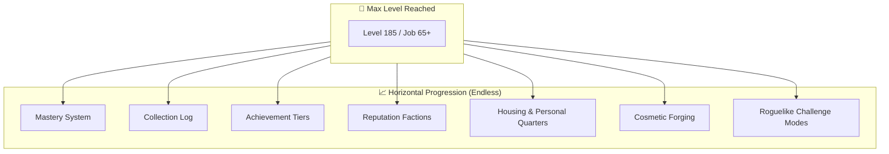

# Endgame & Mastery Specification

🔗 **Backlink:** [Main Implementation Plan](../implementation_plan.md)

> [!IMPORTANT]  
> Max level should represent the **START** of the endgame, not the end of purpose. This specification defines horizontal progression systems that provide infinite longevity without forcing gear reset loops.

---

## 1. Horizontal Progression Architecture



---

## 2. Mastery System (Account-Wide Post-Cap Growth)

When reaching maximum level, monster EXP converts directly into account-wide **Mastery Points** (`#MASTERY_POINTS`):

```c
// Script hook on monster kill
OnNPCKillEvent:
    if (BaseLevel >= 185 && JobLevel >= 65) {
        #MASTERY_POINTS += 1;
        // Every 1,000 points unlocks micro-stat choices
    }
```

### Mastery Tiers & Account Perks
| Mastery Tier | Points Required | Permanent Account Unlock |
|:---|:---|:---|
| **Tier 1** | 1,000 Points | +1% to any chosen basic attribute (STR, AGI, VIT, INT, DEX, LUK) |
| **Tier 2** | 3,000 Points | +1 Permanent inventory slot |
| **Tier 3** | 6,000 Points | +1% Base movement speed |
| **Tier 4** | 10,000 Points | +2% Item drop rate bonus |
| **Tier 5+** | Scaling (+5k/tier) | Cosmetic particle aura / prestige account titles |

> **Balance Rule:** Mastery bonuses are deliberately small to avoid mathematical breaking points while offering infinite micro-progression.

---

## 3. Zone-Based Collection Log

Tracks and rewards full regional exploration and monster drops:
- **Regional Drop Completion:** Slaying monsters and collecting 1 of every drop in a map zone awards regional badges and headgears.
- **Card Almanac:** Logging unique card drops unlocks account titles and cosmetic aura colors.
- **Equipment Catalogue:** Collecting full armor sets unlocks passive set bonuses.

```c
// Prontera Field Collection NPC
prontera,150,190,4	script	Collection Officer	4_F_KAFRA2,{
    mes "[Collector's Guild]";
    mes "Prontera Field Collection: " + #prt_field_collect + "/50 drops.";
    if (#prt_field_collect >= 50 && #prt_field_reward == 0) {
        #prt_field_reward = 1;
        getitem 5020, 1;  // Costume Prontera Hat
        mes "Congratulations! You have completed the Prontera Zone Log!";
    }
    close;
}
```

---

## 4. Achievement Tiers (Repeating Challenges)

Built on rAthena's achievement framework, achievements repeat at escalated thresholds with titles and cosmetic tokens:

| Achievement Category | Bronze Tier | Silver Tier | Gold Tier | Diamond Master |
|:---|:---|:---|:---|:---|
| **Poring Hunter** | 100 kills | 1,000 kills | 10,000 kills | 100,000 kills |
| **Master Blacksmith** | Refine 1 to +10 | Refine 5 to +10 | Refine 20 to +10 | Refine 50 to +10 |
| **Solo MvP Slayer** | 10 Boss kills | 50 Boss kills | 200 Boss kills | 1,000 Boss kills |
| **Dungeon Delver** | 5 Clears | 25 Clears | 100 Clears | 500 Clears |

---

## 5. Reputation Factions

Distinct NPC factions across Midgard offering daily quests and rep-locked quartermaster shops:

| Faction Name | Location / Base | Thematic Focus | Exclusive Reputation Rewards |
|:---|:---|:---|:---|
| **Prontera Knights** | Prontera Sanctuary | Combat & Boss hunting | Exclusive weapon costume skins |
| **Morroc Traders** | Morroc Oasis | Resource supply & logistics | Trade quota expansions & fee discounts |
| **Geffen Scholars** | Geffen Magic Tower | Arcane lore & ruins study | Skill cooldown reduction consumables |
| **Payon Rangers** | Payon Forest | Scouting & archery | Field movement speed & drop buffs |

---

## 6. Roguelike Challenge Modes

An instanced dungeon generator where players select 3 randomized modifiers for escalating difficulty and cosmetic rewards:

```
Challenge Dungeon Entry:
├── Select 3 random modifiers:
│   ├── "Monsters possess +50% Max HP"
│   ├── "Consumable healing disabled"
│   └── "Elite mob spawn frequency +100%"
├── Clear dungeon floors under active modifiers
├── Performance score calculated (Clear time, damage taken, kills)
└── Weekly leaderboards + exclusive cosmetic titles
```

---

## 7. Alt-Character Synergies

- **Account-Wide Mastery:** All alts immediately benefit from earned Mastery Points.
- **Heirloom Equipment:** Craftable account-bound gear usable by any class on the account.
- **Veteran Alt EXP Bonus:** Having a max-level character grants all lower-level alts on the account a permanent **+50% EXP boost**.
- **Tutorial Skips:** Alts can bypass intro quests and receive immediate starting gear.
