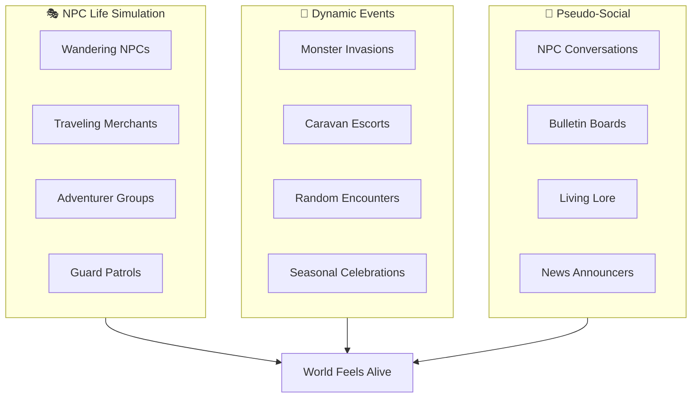

# Living World & Dynamic Events Specification

🔗 **Backlink:** [Main Implementation Plan](../implementation_plan.md)

> [!IMPORTANT]  
> This is the CRITICAL innovation for solo play. An empty server must still feel alive. Designed for 1-3 players, script-only implementation, and an ambient world that never feels dead or abandoned.

---

## 1. The Living World Philosophy

### The Problem
Solo and low-population servers often suffer from:
- Ghost towns with zero player activity
- An abandoned world with no sense of life or passage of time
- A lonely grind without social texture or ambient interactions
- Static maps that feel frozen

### The Solution: Ambient Life Layer (Script-Only)



---

## 2. Wandering NPC System

| NPC Type | Behavior | Script Implementation |
|:---|:---|:---|
| **Traveling Merchants** | Appear at random towns with rotating regional stock | `OnTimer` + random spawn script |
| **Adventurer Parties** | "Players" who hunt monsters, chat, and rest | Mob with custom AI sprites + dialogue |
| **Town Guards** | Patrol paths, react to players, share rumors | Waypoint scripts with interaction |
| **Villagers** | Day/night schedules, go to work / home / tavern | Time-based spawn/despawn |
| **Bards & Storytellers** | Share lore, sing songs at taverns | Random dialogue rotation |

### Traveling Merchant "Marcus" Example
```
Traveling Merchant "Marcus"
├── Spawns in Prontera (Mon/Wed/Fri)
├── Says "Fresh goods from Payon!"
├── Sells unique regional items
├── Despawns after 3 hours
└── Next appears in Geffen (Tue/Thu/Sat)
```

---

## 3. Dynamic Event System

| Event Type | Frequency | Script Trigger |
|:---|:---|:---|
| **Monster Invasion** | Random 2-4x daily | Timer + random map selection |
| **Lost Traveler** | Every 2 hours | Random field spawn, escort quest |
| **Treasure Hunt** | Daily | Clue NPCs + hidden item spawns |
| **Weather Events** | Ambient | Visual effects + buff/debuff zones |
| **Festival Days** | Weekly | Scheduled town decorations + NPCs |

---

## 4. World News & Bulletin Boards

Every town features a **Town Crier NPC** that announces:
- Recent MvP kills (even by NPCs!)
- Active events happening across the realm
- Merchant arrivals and trade caravans
- Weather/season shifts
- "Rumors" that hint at secret quests and hidden treasures

```
Town Crier: "Hear ye! The adventurer Marcus slew 
a Baphomet yesterday! The roads are safer... for now."

Town Crier: "A traveling merchant from the East 
has arrived at South Prontera gate!"
```

---

## 5. Fake Player Activity (Ethical Transparency)

> [!NOTE]  
> These are clearly marked as NPCs, not fake "online players." They exist purely for immersion and atmosphere.

| Feature | Purpose |
|:---|:---|
| **NPC Adventurers** | Named NPCs with job sprites that "hunt" in fields |
| **Combat Sounds** | Distant sound effects in dungeons |
| **Camp Sites** | Temporary NPC camps that appear and disappear |
| **Crafting NPCs** | NPCs visibly crafting at workbenches in blacksmith guilds |

---

## 6. Quest-Obtainable Premium Items

> [!CAUTION]  
> All "cash shop" tier items are obtainable in-game. Character-bound. Economy-safe.

### The Dual-Path Philosophy

```
Premium Item
     │
     ├──► Long Quest Chain (Weeks of effort)
     │         └── Guaranteed reward
     │
     └──► Easter Egg NPCs (Luck/Knowledge)
               └── Answer correctly on first meeting = instant reward!
```

### Easter Egg NPC Examples

| NPC | Location | Trigger | Reward |
|:---|:---|:---|:---|
| **Old Sage** | Hidden cave in Payon | "What is the true meaning of power?" → "To protect others" | Costume Aura |
| **Lost Child** | Random spawn | Give them a Candy (not asked for) | Premium Pet Egg |
| **Riddler** | Changes location daily | Solve riddle on first attempt | Battle Manual x50 |
| **Ghost Knight** | Glast Heim at midnight | Bow to him before he speaks | Shadow Gear box |

### Long Quest Examples

| Quest | Duration | Requirements | Reward |
|:---|:---|:---|:---|
| **Path of the Collector** | ~3 weeks | Collect 1 of every monster drop in a region | Premium Headgear |
| **The Artisan's Journey** | ~2 weeks | Craft 100 different items | Bubble Gum x100 |
| **Monster Researcher** | ~1 month | Defeat every monster species once | Enriched Ores box |
| **Lore Master** | ~2 weeks | Find and read 50 hidden books | Costume Wings |

### Safety Mechanisms

| Mechanism | Purpose |
|:---|:---|
| **Character-Bound** | Cannot be traded or sold to disrupt market balance |
| **Reasonable Power** | Nice to have, not required to complete content |
| **Consumables Limited** | Battle Manuals give 50% bonus, stack limit 10/week |
| **No Exclusive Power** | Similar items obtainable through normal gameplay loops |
